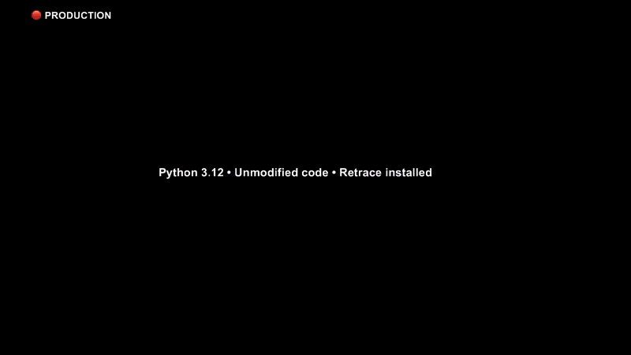

# Retrace

Retrace is the first production-grade reverse debugger for CPython.

Record a run of your Python program, then replay that exact run in VS Code
(today) or any DAP-compatible debugger (soon), and step backwards through it
as many times as you need. Every variable, every external call, every value
is preserved. Recording overhead is under 0.1%, so production processes can
stay recorded.

  

Some bugs are nearly impossible to reproduce from logs and a stack trace
alone. A race condition that fires once in a thousand runs. A flaky test
that passes when you re-run it. A web request that crashed in production
with input you will never see again. An LLM agent whose output depended on
a sequence of API responses that are now gone. Once Retrace has the
recording, you step backwards from the crash to the cause, repeatedly,
without rerunning the program.

## A 30-Second Example

Record any Python program by prefixing the command with a recording path:

    $ RETRACE_RECORDING=run.retrace python myapp.py
    Traceback (most recent call last):
      File "myapp.py", line 42, in process
        return total / divisor
    ZeroDivisionError: division by zero

Open `run.retrace` in VS Code, set a breakpoint on line 42, hit it on
replay, and step backwards to see exactly which earlier call produced the
zero, with the same locals and same call stack the program had when it
crashed. The recording is the program. No reproduction steps, no re-runs.

## How It Works

Retrace records the boundary between your Python code and the
nondeterministic outside world: network responses, filesystem state,
clocks, randomness, LLM outputs, subprocess behavior, thread scheduling.
During replay, your Python code runs for real, but those recorded boundary
calls return their captured values instead of touching the live world.
That makes replay deterministic and lets the debugger step in either
direction.
Retrace is not a logging library. You do not decide in advance which variables, branches, or errors might matter.

Retrace is not a metrics or tracing dashboard. It does not sample requests or aggregate performance data across your application.

Retrace is not `rr` for Python. It does not record an entire machine process at the syscall level. Instead, it records the boundary between your Python code and the outside world, then replays those interactions so the original execution can be debugged deterministically.

## Built For Humans And AI Agents

Retrace gives a debugger or an AI coding agent the runtime ground truth of
a failed execution, not just source code, logs, and a stack trace. CLI
access and AI-agent workflows are arriving alongside the VS Code path.

## Quick Start

The fastest way to try Retrace is the included Flask demo.

    git clone https://github.com/retracesoftware/retracesoftware.git
    cd retracesoftware/quickstart

    go version

    python3.12 -m venv .venv
    source .venv/bin/activate

    python -m pip install --upgrade pip
    python -m pip install retracesoftware
    python -m retracesoftware install
    python -m pip install -r requirements.txt

    RETRACE_RECORDING=recordings/flask.retrace python examples/flask_demo.py
    code .

In VS Code:

1. Install the `Retrace Debug Extension` from the Marketplace.
2. Open the Retrace sidebar.
3. Choose `Open Recording...`.
4. Select `recordings/flask.retrace`.
5. Open `examples/flask_demo.py`.
6. Set a breakpoint inside a route handler or inside `main()`.
7. Start replay from the Retrace view.

The replay should stop at your breakpoint inside the recorded execution. You can
inspect variables, continue, step forward, and step backward without running the
Flask demo live again.

For the full walkthrough, see [quickstart/README.md](quickstart/README.md).

## Requirements

- CPython 3.11 or 3.12
- macOS or Linux, 64-bit
- `pip`
- Go 1.25 or newer on `PATH`

Retrace installs with `pip`, but replay extraction and VS Code replay/debugging
use Retrace's Go replay tool. If `go version` does not work, install Go before
recording/replaying.

On macOS with Homebrew:

    brew install go

On Linux, install Go 1.25 or newer from your distro packages or from [go.dev/dl](https://go.dev/dl/).

## How Recording Works

Install the package:

    python -m pip install retracesoftware

Enable the auto-recording hook in the active virtual environment:

    python -m retracesoftware install

That installs a `.pth` file into the environment. Fresh Python processes in
that environment import Retrace at startup, but they only record when you set a
Retrace environment variable.

Record an ordinary Python file:

    RETRACE_RECORDING=recordings/run.retrace python my_script.py

Retrace creates the parent directory if needed and writes an executable
`.retrace` file. The recording stores the command, working directory,
environment, Python version, Retrace checksums, and recorded boundary calls.

You can also record without the `.pth` hook:

    python -m retracesoftware --recording recordings/run.retrace -- my_script.py

For module-based apps and tools, put `RETRACE_RECORDING=...` before the same
Python command you would normally run:

    RETRACE_RECORDING=recordings/cli.retrace python -m your_package.cli --input examples/input.json
    RETRACE_RECORDING=recordings/tests.retrace python -m pytest tests/
    RETRACE_RECORDING=recordings/debug.retrace python -c "import random; print(random.random())"

For more examples, see [docs/getting-started/recording-python-commands.md](docs/getting-started/recording-python-commands.md).

## Replay And Debug In VS Code

Open the same folder that contains your source and `.retrace` file:

    code .

Then open the recording from the Retrace sidebar or right-click the `.retrace`
file and choose `Open as Retrace Recording`.

The extension reads the replay binary path embedded in the `.retrace` shebang,
indexes the recorded process tree, and launches replay debugging through the Go
replay tool.

Set breakpoints in the recorded Python code and start replay. The debugger runs
the recorded execution, not a live process.

See [docs/getting-started/vscode-extension.md](docs/getting-started/vscode-extension.md).

## Other Editors And CLI

Retrace speaks the Debug Adapter Protocol, so any DAP-compatible debugger
should be able to drive a Retrace replay session. VS Code is the first
supported editor; PyCharm, Zed, and other DAP clients are on the path.

A standalone CLI workflow is also coming, so you will not need an editor at
all to drive a replay. Watch the [Discussions](https://github.com/retracesoftware/retracesoftware/discussions) for updates.

## Terminal Replay

Extract the recording:

    ./recordings/run.retrace --extract

That creates:

    recordings/run.d/index.json
    recordings/run.d/<PID>.bin

Find the root process:

    ROOT_PID=$(python -m retracesoftware --recording recordings/run.retrace --list_pids | head -1)

Replay it:

    ./recordings/run.d/${ROOT_PID}.bin

## Documentation

- [Documentation index](docs/README.md)
- [Getting started](docs/getting-started/README.md)
- [Installation](docs/getting-started/installation.md)
- [Quickstart](quickstart/README.md)
- [Recording Python commands](docs/getting-started/recording-python-commands.md)
- [VS Code extension](docs/getting-started/vscode-extension.md)
- [Reference](docs/reference/README.md)
- [CLI reference](docs/reference/cli.md)
- [Environment variables](docs/reference/environment-variables.md)
- [Recording files](docs/reference/recording-files.md)
- [Compatibility](COMPATIBILITY.md)
- [Troubleshooting](docs/troubleshooting.md)
- [Internals](docs/internals/README.md)
- [Architecture](docs/internals/architecture.md)

## Development From Source

Install from this checkout:

    python -m pip install --upgrade pip wheel
    python -m pip install "meson>=1.3" "meson-python>=0.18.0" "setuptools_scm>=8.0.4" ninja
    python -m pip install --no-build-isolation -e .

The package includes Python code, native extensions built by Meson, module
interception config, and the Go replay tooling used for extraction, terminal
replay, and VS Code replay/debugging. Supported wheels include the replay
binary; source/development installs can build it lazily if it is missing, which
is why Go is required on `PATH`.

Run Python tests:

    python -m pytest tests/ -v --tb=short

Run Go tests:

    cd go
    go test ./...

## Repository Layout

- `quickstart/` first-run demo and public quickstart flow
- `src/retracesoftware/__main__.py` CLI record/replay entrypoint
- `src/retracesoftware/autoenable.py` `.pth` startup hook implementation
- `src/retracesoftware/tape.py` recording file setup, checksums, and tape I/O
- `src/retracesoftware/install/` runtime patching and import hooks
- `src/retracesoftware/proxy/` record/replay boundary semantics
- `src/retracesoftware/modules/` stdlib and third-party interception config
- `src/retracesoftware/stream/` and `cpp/stream/` trace serialization
- `src/retracesoftware/dap/` Python debugger protocol pieces
- `go/` replay extraction, indexing, and debug adapter tooling
- `vscode/` VS Code extension
- `tests/` and `dockertests/` unit, replay, and scenario tests
- `docs/` user and maintainer documentation

## License

Apache-2.0
