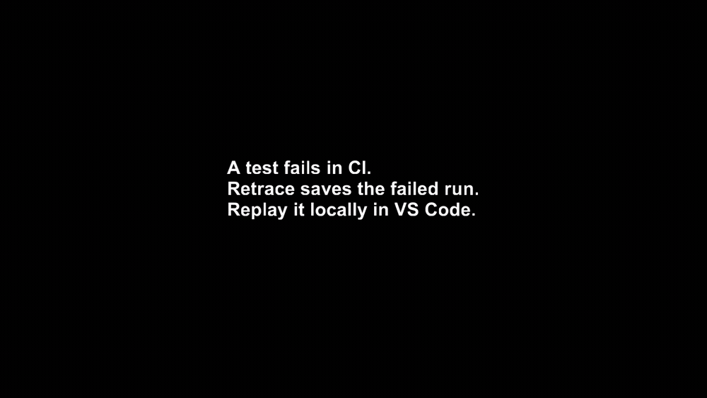

# Retrace

Turn failed Python tests and CI runs into replayable debug sessions.

Retrace records a Python execution as a `.retrace` artifact. When pytest or CI fails, open the artifact locally in VS Code, replay the same failed run, and step backwards from the failure to inspect the runtime state that caused it.

The same recording model works for Python apps and production crashes. Start with tests today; move to production when the trust is there.

<p align="center">
  
</p>

**Start here:** [Replay a failed pytest run with the full quickstart](quickstart/README.md).

## Why Retrace

Most failed test and CI artifacts are logs, tracebacks, screenshots, or partial traces. They show symptoms. They do not preserve the execution.

Retrace preserves the failed run itself.

| Today | With Retrace |
|---|---|
| CI artifacts are logs and tracebacks | CI artifact is replayable |
| AI agents infer from partial context | AI agents get runtime evidence |
| Stack trace shows where it crashed | Replay shows what happened before |
| Logs show what you predicted would matter | Retrace preserves the failed execution |

The failed execution becomes something you can inspect, replay, and share.

## Quick Start: Replay a Failed pytest Run

Install Retrace in your virtual environment:

    python -m pip install retracesoftware pytest

Run pytest through Retrace's explicit runner:

    PYTEST_DISABLE_PLUGIN_AUTOLOAD=1 python -m retracesoftware --recording recordings/pytest.retrace -- -m pytest tests -q --tb=short

If pytest fails, Retrace leaves behind a `.retrace` artifact for that exact failed run.

This is the recommended preview command for pytest. It keeps pytest plugin loading explicit so the first-run demo stays focused, repeatable, and easy to inspect.

Open the same project in VS Code:

    code .

Then:

1. Install the `Retrace Debug Extension` from the Marketplace.
2. Open the Retrace sidebar.
3. Choose `Open Recording...`.
4. Select `recordings/pytest.retrace`.
5. Open the failing test or the code under test.
6. Set a breakpoint near the failing assertion or exception.
7. Start replay from the Retrace view.

You can now debug the failed execution locally, inspect runtime state, and step backwards from the failure without re-running the test.

## CI Artifacts

Retrace works with ordinary CI artifact upload.

For example, in GitHub Actions:

    - name: Run pytest with Retrace
      run: |
        mkdir -p recordings
        set +e
        PYTEST_DISABLE_PLUGIN_AUTOLOAD=1 \
          python -m retracesoftware --recording recordings/pytest.retrace -- -m pytest tests -q --tb=short
        PYTEST_STATUS=$?
        exit "$PYTEST_STATUS"

    - name: Upload Retrace recording
      if: failure()
      uses: actions/upload-artifact@v4
      with:
        name: retrace-failed-run
        path: recordings/pytest.retrace

A failed CI run becomes a replayable artifact. Download it, open it locally in VS Code, and debug the same execution that failed in CI.

No hosted trace service or GitHub App is required.

## A 30-Second Example

A test fails:

    PYTEST_DISABLE_PLUGIN_AUTOLOAD=1 python -m retracesoftware --recording recordings/failure.retrace -- -m pytest tests/test_checkout.py -q --tb=short

Instead of rerunning and guessing, open `recordings/failure.retrace` in VS Code. Replay the exact failed execution, inspect locals and call stack, and step backwards from the failing assertion to the state that caused it.

The recording is the failed run. No reproduction steps, no retry loop, no guessing from logs.

## How It Works

1. **Run**

   Run pytest, CI, or your Python app with Retrace enabled.

2. **Record**

   Retrace records the execution into a `.retrace` artifact.

3. **Replay**

   Open the artifact locally in VS Code and debug the same execution.

4. **Step backwards**

   Move backwards from the failure and inspect the runtime state that caused it.

Under the hood, Retrace records the boundary between your Python code and the nondeterministic outside world: network responses, filesystem state, clocks, randomness, subprocess behavior, thread scheduling, API calls, database calls, and other external effects.

During replay, your Python code runs for real, but those recorded boundary calls return their captured values instead of touching the live world. That makes replay deterministic and lets the debugger move through the original execution.

## Built For Humans And AI Agents

Retrace gives a developer, debugger, or AI coding agent the runtime ground truth of a failed execution, not just source code, logs, and a stack trace.

That matters because AI agents often infer what happened from partial context. A `.retrace` artifact gives them runtime evidence from the actual failed run.

CLI access and AI-agent workflows are arriving alongside the VS Code path.

## Full Quickstart

The full quickstart includes a small failing pytest demo, a replay bundle helper, terminal replay, and VS Code replay debugging.

Clone the repo and enter the quickstart directory:

    git clone https://github.com/retracesoftware/retracesoftware.git
    cd retracesoftware/quickstart

Check Go is installed:

    go version

Create and activate a virtual environment:

    python3.12 -m venv .venv
    source .venv/bin/activate

Install Retrace and the demo dependencies:

    python -m pip install --upgrade pip
    python -m pip install retracesoftware
    python -m pip install -r requirements.txt

Record the pytest demo:

    PYTEST_DISABLE_PLUGIN_AUTOLOAD=1 python -m retracesoftware --recording recordings/pytest.retrace -- -m pytest pytest_demo -q --tb=short

Open the project in VS Code:

    code .

In VS Code:

1. Install the `Retrace Debug Extension` from the Marketplace.
2. Open the Retrace sidebar.
3. Choose `Open Recording...`.
4. Select `recordings/pytest.retrace`.
5. Open `pytest_demo/checkout.py`.
6. Set a breakpoint inside `build_receipt`.
7. Start replay from the Retrace view.

The replay should stop at your breakpoint inside the recorded execution. You can inspect variables, continue, step forward, and step backward without running pytest live again.

For the full walkthrough, see [quickstart/README.md](quickstart/README.md).

## Production Is The Destination

The `.retrace` artifact from a failed test uses the same architecture as a production crash replay.

Start with tests today. Run the same tool against production when the trust is there.

Retrace records the boundary between your Python code and the outside world — databases, APIs, files, time, randomness, and other nondeterministic calls — then replays those results locally.

Recording overhead is designed to be low enough for production processes to stay recorded.

## What Retrace Is Not

Retrace is not a logging library. You do not decide in advance which variables, branches, or errors might matter.

Retrace is not a metrics or tracing dashboard. It does not sample requests or aggregate performance data across your application.

Retrace is not `rr` for Python. It does not record an entire machine process at the syscall level. Instead, it records the boundary between your Python code and the outside world, then replays those interactions so the original execution can be debugged deterministically.

## Requirements

- CPython 3.11 or 3.12
- macOS or Linux, 64-bit
- `pip`
- Go 1.25 or newer on `PATH`
- VS Code for the current replay/debugging workflow

Retrace installs with `pip`, but replay extraction and VS Code replay/debugging use Retrace's Go replay tool. If `go version` does not work, install Go before recording/replaying.

On macOS with Homebrew:

    brew install go

On Linux, install Go 1.25 or newer from your distro packages or from [go.dev/dl](https://go.dev/dl/).

## Recording Python Commands

Install the package:

    python -m pip install retracesoftware

Enable the auto-recording hook in the active virtual environment:

    python -m retracesoftware install

That installs a `.pth` file into the environment. Fresh Python processes in that environment import Retrace at startup, but they only record when you set a Retrace environment variable.

Record an ordinary Python file:

    RETRACE_RECORDING=recordings/run.retrace python my_script.py

Record a pytest run:

    PYTEST_DISABLE_PLUGIN_AUTOLOAD=1 python -m retracesoftware --recording recordings/tests.retrace -- -m pytest tests/ -q --tb=short

Record a module-based CLI:

    RETRACE_RECORDING=recordings/cli.retrace python -m your_package.cli --input examples/input.json

Record a one-off command:

    RETRACE_RECORDING=recordings/debug.retrace python -c "import random; print(random.random())"

Retrace creates the parent directory if needed and writes an executable `.retrace` file. The recording stores the command, working directory, environment, Python version, Retrace checksums, and recorded boundary calls.

You can also record without the `.pth` hook:

    python -m retracesoftware --recording recordings/run.retrace -- my_script.py

For more examples, see [docs/getting-started/recording-python-commands.md](docs/getting-started/recording-python-commands.md).

## Replay And Debug In VS Code

Open the same folder that contains your source and `.retrace` file:

    code .

Then open the recording from the Retrace sidebar or right-click the `.retrace` file and choose `Open as Retrace Recording`.

The extension reads the replay binary path embedded in the `.retrace` shebang, indexes the recorded process tree, and launches replay debugging through the Go replay tool.

Set breakpoints in the recorded Python code and start replay. The debugger runs the recorded execution, not a live process.

See [docs/getting-started/vscode-extension.md](docs/getting-started/vscode-extension.md).

## Terminal Replay

Extract the recording:

    ./recordings/run.retrace --extract

That creates:

    recordings/run.d/index.json
    recordings/run.d/<PID>.bin

Find the root process:

    ROOT_PID=$(python -m retracesoftware --recording recordings/run.retrace --list_pids | head -1)

Replay it:

    ./recordings/run.d/${ROOT_PID}.bin

## Other Editors And CLI

Retrace speaks the Debug Adapter Protocol, so any DAP-compatible debugger should be able to drive a Retrace replay session.

VS Code is the first supported editor. PyCharm, Zed, and other DAP clients are on the path.

A standalone CLI workflow is also coming, so you will not need an editor at all to drive a replay. Watch the [Discussions](https://github.com/retracesoftware/retracesoftware/discussions) for updates.

## Documentation

- [Documentation index](docs/README.md)
- [Getting started](docs/getting-started/README.md)
- [Installation](docs/getting-started/installation.md)
- [Quickstart](quickstart/README.md)
- [Recording Python commands](docs/getting-started/recording-python-commands.md)
- [VS Code extension](docs/getting-started/vscode-extension.md)
- [Reference](docs/reference/README.md)
- [CLI reference](docs/reference/cli.md)
- [Environment variables](docs/reference/environment-variables.md)
- [Recording files](docs/reference/recording-files.md)
- [Compatibility](COMPATIBILITY.md)
- [Troubleshooting](docs/troubleshooting.md)
- [Internals](docs/internals/README.md)
- [Architecture](docs/internals/architecture.md)

## Development From Source

Install from this checkout:

    python -m pip install --upgrade pip wheel
    python -m pip install "meson>=1.3" "meson-python>=0.18.0" "setuptools_scm>=8.0.4" ninja
    python -m pip install --no-build-isolation -e .

The package includes Python code, native extensions built by Meson, module interception config, and the Go replay tooling used for extraction, terminal replay, and VS Code replay/debugging.

Supported wheels include the replay binary. Source/development installs can build it lazily if it is missing, which is why Go is required on `PATH`.

Run Python tests:

    python -m pytest tests/ -v --tb=short

Run Go tests:

    cd go
    go test ./...

## Repository Layout

- `quickstart/` first-run demo and public quickstart flow
- `src/retracesoftware/__main__.py` CLI record/replay entrypoint
- `src/retracesoftware/autoenable.py` `.pth` startup hook implementation
- `src/retracesoftware/tape.py` recording file setup, checksums, and tape I/O
- `src/retracesoftware/install/` runtime patching and import hooks
- `src/retracesoftware/proxy/` record/replay boundary semantics
- `src/retracesoftware/modules/` stdlib and third-party interception config
- `src/retracesoftware/stream/` and `cpp/stream/` trace serialization
- `src/retracesoftware/dap/` Python debugger protocol pieces
- `go/` replay extraction, indexing, and debug adapter tooling
- `vscode/` VS Code extension
- `tests/` and `dockertests/` unit, replay, and scenario tests
- `docs/` user and maintainer documentation

## License

Apache-2.0
```
