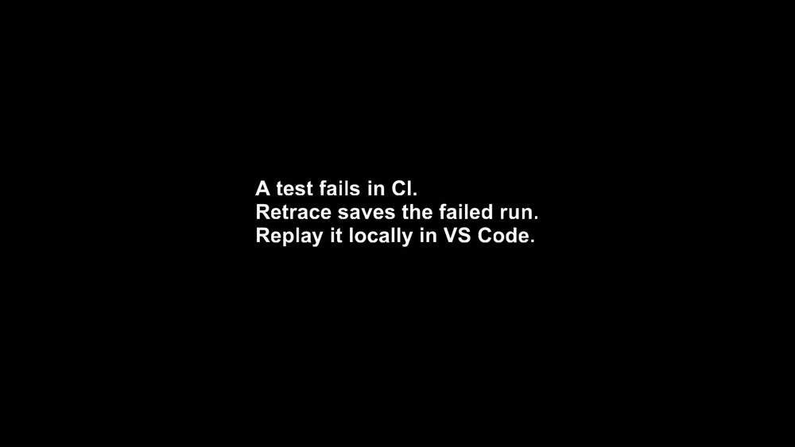

# Retrace

Turn failed Python tests and CI runs into AI-debuggable replay sessions.

Retrace records a Python execution as a `.retrace` artifact. When pytest or CI
fails, Retrace can replay the same failed run through the AI debugger and write
a report, or you can open the artifact locally in VS Code and inspect the
runtime state yourself.

The same recording model works for Python apps and production crashes. Start with tests today; move to production when the trust is there.

<p align="center">
  
</p>

**Start here:** use the pytest AI-debugger quick start below, or follow the
[manual VS Code replay quickstart](quickstart/README.md).

## Why Retrace

Most failed test and CI artifacts are logs, tracebacks, screenshots, or partial traces. They show symptoms. They do not preserve the execution.

Retrace preserves the failed run itself.

| Today | With Retrace |
|---|---|
| CI artifacts are logs and tracebacks | CI artifact is replayable |
| AI agents infer from partial context | AI agents get runtime evidence |
| Stack trace shows where it crashed | Replay shows what happened before |
| Logs show what you predicted would matter | Retrace preserves the failed execution |

The failed execution becomes something you can inspect, replay, and share.

## Quick Start: AI-Debug a Failed pytest Run

Install Retrace in your virtual environment:

    python -m pip install --upgrade pip
    python -m pip install --upgrade retracesoftware pytest

Check that both the Python package and the split DAP/replay package installed:

    python -m pip show retracesoftware
    python -m pip show retracesoftware-dap

Print the same pytest AI-debugger setup in your terminal at any time:

    retrace quickstart

Set auto-debug once for the current terminal, create a recordings directory, and
run your normal pytest command through `retracepython`:

    export RETRACE_AUTO_DEBUG=1
    mkdir -p recordings
    retracepython --recording recordings/pytest.retrace -m pytest tests

You can keep your usual pytest arguments:

    retracepython --recording recordings/pytest.retrace -m pytest tests -vs
    retracepython --recording recordings/pytest.retrace -m pytest tests/test_example.py
    retracepython --recording recordings/pytest.retrace -m pytest tests/test_example.py -k "some_test"

This runs the real pytest command, records the execution to
`recordings/pytest.retrace`, and, if pytest fails, replays the recording through
the DAP AI debugger. Retrace preserves pytest's original exit code and writes an
AI report next to the trace:

    recordings/pytest.ai-report.md

Open that report in your editor. On macOS:

    open recordings/pytest.ai-report.md

The default hosted auto-debug flow can request a free client token
automatically. You normally do not need `RETRACE_API_KEY` for a first run; set
it only when you want to use an authenticated Retrace AI service account.

There is also a shorter form:

    RETRACE_AUTO_DEBUG=1 retracepython -m pytest tests

The short form writes default artifacts in the current directory, usually
`pytest.retrace` and `pytest.ai-report.md`. The explicit `--recording
recordings/pytest.retrace` form is recommended because it keeps artifacts in a
predictable location across environments.

## Quick Start: Replay a Failed pytest Run In VS Code

If you want a manual replay/debugging session instead of an AI report, run
pytest through Retrace's explicit runner:

    mkdir -p recordings
    PYTEST_DISABLE_PLUGIN_AUTOLOAD=1 python -m retracesoftware --recording recordings/pytest.retrace -- -m pytest tests -q --tb=short

If pytest fails, Retrace leaves behind a `.retrace` artifact for that exact failed run.

This preview command keeps pytest plugin loading explicit so the first-run demo
stays focused, repeatable, and easy to inspect.

Open the same project in VS Code:

    code .

Then:

1. Install the `Retrace Debug Extension` from the Marketplace.
2. Open the Retrace sidebar.
3. Choose `Open Recording...`.
4. Select `recordings/pytest.retrace`.
5. Open the failing test or the code under test.
6. Set a breakpoint near the failing assertion or exception.
7. Start replay from the Retrace view.

You can now debug the failed execution locally, inspect runtime state, and step backwards from the failure without re-running the test.

## CI Artifacts

Retrace works with ordinary CI artifact upload.

For example, in GitHub Actions:

    - name: Run pytest with Retrace
      run: |
        mkdir -p recordings
        set +e
        PYTEST_DISABLE_PLUGIN_AUTOLOAD=1 \
          python -m retracesoftware --recording recordings/pytest.retrace -- -m pytest tests -q --tb=short
        PYTEST_STATUS=$?
        exit "$PYTEST_STATUS"

    - name: Upload Retrace recording
      if: failure()
      uses: actions/upload-artifact@v4
      with:
        name: retrace-failed-run
        path: recordings/pytest.retrace

A failed CI run becomes a replayable artifact. Download it, open it locally in VS Code, and debug the same execution that failed in CI.

No hosted trace service or GitHub App is required.

## A 30-Second Example

A test fails:

    PYTEST_DISABLE_PLUGIN_AUTOLOAD=1 python -m retracesoftware --recording recordings/failure.retrace -- -m pytest tests/test_checkout.py -q --tb=short

Instead of rerunning and guessing, open `recordings/failure.retrace` in VS Code. Replay the exact failed execution, inspect locals and call stack, and step backwards from the failing assertion to the state that caused it.

The recording is the failed run. No reproduction steps, no retry loop, no guessing from logs.

## How It Works

1. **Run**

   Run pytest, CI, or your Python app with Retrace enabled.

2. **Record**

   Retrace records the execution into a `.retrace` artifact.

3. **Replay**

   Replay the artifact through the AI debugger or open it locally in VS Code.

4. **Inspect**

   Inspect the runtime state that caused the failure instead of rerunning live.

Under the hood, Retrace records the boundary between your Python code and the nondeterministic outside world: network responses, filesystem state, clocks, randomness, subprocess behavior, thread scheduling, API calls, database calls, and other external effects.

During replay, your Python code runs for real, but those recorded boundary calls return their captured values instead of touching the live world. That makes replay deterministic and lets the debugger move through the original execution.

## Built For Humans And AI Agents

Retrace gives a developer, debugger, or AI coding agent the runtime ground truth of a failed execution, not just source code, logs, and a stack trace.

That matters because AI agents often infer what happened from partial context. A `.retrace` artifact gives them runtime evidence from the actual failed run.

CLI access and AI-agent workflows are arriving alongside the VS Code path.

## Full Quickstart

The full quickstart includes a small failing pytest demo, a replay bundle helper, terminal replay, and VS Code replay debugging.

Clone the repo and enter the quickstart directory:

    git clone https://github.com/retracesoftware/retracesoftware.git
    cd retracesoftware/quickstart

Create and activate a virtual environment:

    python3.12 -m venv .venv
    source .venv/bin/activate

Install Retrace and the demo dependencies:

    python -m pip install --upgrade pip
    python -m pip install retracesoftware
    python -m pip install -r requirements.txt

Record the pytest demo:

    PYTEST_DISABLE_PLUGIN_AUTOLOAD=1 python -m retracesoftware --recording recordings/pytest.retrace -- -m pytest pytest_demo -q --tb=short

Open the project in VS Code:

    code .

In VS Code:

1. Install the `Retrace Debug Extension` from the Marketplace.
2. Open the Retrace sidebar.
3. Choose `Open Recording...`.
4. Select `recordings/pytest.retrace`.
5. Open `pytest_demo/checkout.py`.
6. Set a breakpoint inside `build_receipt`.
7. Start replay from the Retrace view.

The replay should stop at your breakpoint inside the recorded execution. You can inspect variables, continue, step forward, and step backward without running pytest live again.

For the full walkthrough, see [quickstart/README.md](quickstart/README.md).

## Production Is The Destination

The `.retrace` artifact from a failed test uses the same architecture as a production crash replay.

Start with tests today. Run the same tool against production when the trust is there.

Retrace records the boundary between your Python code and the outside world — databases, APIs, files, time, randomness, and other nondeterministic calls — then replays those results locally.

Recording overhead is designed to be low enough for production processes to stay recorded.

## What Retrace Is Not

Retrace is not a logging library. You do not decide in advance which variables, branches, or errors might matter.

Retrace is not a metrics or tracing dashboard. It does not sample requests or aggregate performance data across your application.

Retrace is not `rr` for Python. It does not record an entire machine process at the syscall level. Instead, it records the boundary between your Python code and the outside world, then replays those interactions so the original execution can be debugged deterministically.

## Requirements

- CPython 3.11 or 3.12
- macOS or Linux, 64-bit
- `pip`
- VS Code is optional for manual replay/debugging

Supported PyPI wheels include Retrace's replay binary, so normal `pip install retracesoftware` users do not need Go installed. Go is only required when building Retrace from source or on unsupported platforms where `pip` has to build from source.

## Recording Python Commands

Install the package:

    python -m pip install retracesoftware

Installing Retrace does not automatically record Python processes. Choose the
launcher mode that matches the workflow.

### One-Shot Recording

Use `retracepython` when you want to record one command:

    retracepython --recording recordings/run.retrace my_script.py

Record a pytest run:

    mkdir -p recordings
    retracepython --recording recordings/tests.retrace -m pytest tests/ -q --tb=short

Record a module-based CLI:

    retracepython --recording recordings/cli.retrace -m your_package.cli --input examples/input.json

Record a one-off command:

    retracepython --recording recordings/debug.retrace -c "import random; print(random.random())"

`retracepython` is intentionally one-shot. If the recorded program explicitly
runs ordinary `python`, that child process is not automatically recorded.

To automatically run the AI debugger when the recorded command fails, set
`RETRACE_AUTO_DEBUG=1`. You can set it once for the current terminal:

    export RETRACE_AUTO_DEBUG=1
    mkdir -p recordings
    retracepython --recording recordings/run.retrace my_script.py

Or prefix one command:

    RETRACE_AUTO_DEBUG=1 retracepython my_script.py

On failure, Retrace runs `retrace-ai-driver` with the DAP tool executor against
the recording and writes a report next to the trace, for example
`recordings/run.ai-report.md`. The driver starts the Retrace DAP server and
drives it through the `retrace-ai-service`/provider configuration supplied to
the driver. The default hosted service can request a free client token when
`RETRACE_API_KEY` is unset. Configure the driver with environment variables
such as `RETRACE_AI_SERVER`, `RETRACE_API_KEY`, and `RETRACE_REPLAY_BIN` when
you need a custom service, authenticated account, or local replay binary.
`RETRACE_AI_SERVER` defaults to
`https://retrace-ai-service.retracesoftware.workers.dev`.
`RETRACE_AI_DRIVER_COMMAND` can override the packaged driver command for
development.

When auto-debug uses the default recording path, successful runs delete the
temporary trace. If you pass `--recording` or set `RETRACE_RECORDING`, Retrace
keeps that explicit trace even when the command succeeds.

### Retrace-Aware Virtual Environment

Use a Retrace venv when ordinary `python` commands in that environment should
record, including `sys.executable` child processes:

    python -m retracesoftware venv .retrace-venv
    .retrace-venv/bin/python my_script.py

`pip`, `ensurepip`, `venv`, and Retrace's own commands bypass recording inside
the generated venv.

### Active-Environment Hook

If you already have a configured Python environment, install an env-gated hook
into that environment:

    python -m retracesoftware enable-hook
    RETRACE=1 python my_script.py

The hook is inert unless `RETRACE=1`, `RETRACE_AUTO_DEBUG=1`,
`RETRACE_RECORDING`, or `RETRACE_CONFIG` is set. Remove it with:

    python -m retracesoftware disable-hook

Retrace creates the parent directory if needed and writes an executable `.retrace` file. The recording stores the command, working directory, environment, Python version, Retrace checksums, and recorded boundary calls.

You can also record through the underlying CLI:

    python -m retracesoftware --recording recordings/run.retrace -- my_script.py

For more examples, see [docs/getting-started/recording-python-commands.md](docs/getting-started/recording-python-commands.md).

## Replay And Debug In VS Code

Open the same folder that contains your source and `.retrace` file:

    code .

Then open the recording from the Retrace sidebar or right-click the `.retrace` file and choose `Open as Retrace Recording`.

The extension reads the replay binary path embedded in the `.retrace` shebang, indexes the recorded process tree, and launches replay debugging through the Go replay tool.

Set breakpoints in the recorded Python code and start replay. The debugger runs the recorded execution, not a live process.

See [docs/getting-started/vscode-extension.md](docs/getting-started/vscode-extension.md).

## Terminal Replay

Extract the recording:

    ./recordings/run.retrace --extract

That creates:

    recordings/run.d/index.json
    recordings/run.d/<PID>.bin

Find the root process:

    ROOT_PID=$(python -m retracesoftware --recording recordings/run.retrace --list_pids | head -1)

Replay it:

    ./recordings/run.d/${ROOT_PID}.bin

## Other Editors And CLI

Retrace speaks the Debug Adapter Protocol, so any DAP-compatible debugger should be able to drive a Retrace replay session.

VS Code is the first supported editor. PyCharm, Zed, and other DAP clients are on the path.

A standalone CLI workflow is also coming, so you will not need an editor at all to drive a replay. Watch the [Discussions](https://github.com/retracesoftware/retracesoftware/discussions) for updates.

## Documentation

- [Documentation index](docs/README.md)
- [Getting started](docs/getting-started/README.md)
- [Installation](docs/getting-started/installation.md)
- [Quickstart](quickstart/README.md)
- [Recording Python commands](docs/getting-started/recording-python-commands.md)
- [VS Code extension](docs/getting-started/vscode-extension.md)
- [Reference](docs/reference/README.md)
- [CLI reference](docs/reference/cli.md)
- [Environment variables](docs/reference/environment-variables.md)
- [Recording files](docs/reference/recording-files.md)
- [Compatibility](COMPATIBILITY.md)
- [Troubleshooting](docs/troubleshooting.md)
- [Internals](docs/internals/README.md)
- [Architecture](docs/internals/architecture.md)

## Development From Source

Install from this checkout:

    python -m pip install --upgrade pip wheel
    python -m pip install "meson>=1.3" "meson-python>=0.18.0" "setuptools_scm>=8.0.4" ninja
    python -m pip install --no-build-isolation -e .

The package includes Python code, native extensions built by Meson, module interception config, and the Go replay tooling used for extraction, terminal replay, and VS Code replay/debugging.

Supported wheels include the replay binary. Source/development installs build the replay binary locally, so Go 1.25 or newer must be available on `PATH`.

On macOS with Homebrew:

    brew install go

On Linux, install Go 1.25 or newer from your distro packages or from [go.dev/dl](https://go.dev/dl/).

Run Python tests:

    python -m pytest tests/ -v --tb=short

Run Go tests:

    cd go
    go test ./...

## Repository Layout

- `quickstart/` first-run demo and public quickstart flow
- `src/retracesoftware/__main__.py` CLI record/replay entrypoint
- `src/retracesoftware/retracepython.py` and `retrace_venv.py` launcher implementations
- `src/retracesoftware/tape.py` recording file setup, checksums, and tape I/O
- `src/retracesoftware/install/` runtime patching and import hooks
- `src/retracesoftware/proxy/` record/replay boundary semantics
- `src/retracesoftware/modules/` stdlib and third-party interception config
- `src/retracesoftware/stream/` and `cpp/stream/` trace serialization
- `src/retracesoftware/dap/` Python debugger protocol pieces
- `retrace-dap/` replay extraction, indexing, and debug adapter tooling
- `vscode/` VS Code extension
- `tests/` and `dockertests/` unit, replay, and scenario tests
- `docs/` user and maintainer documentation

## License

Apache-2.0
```
