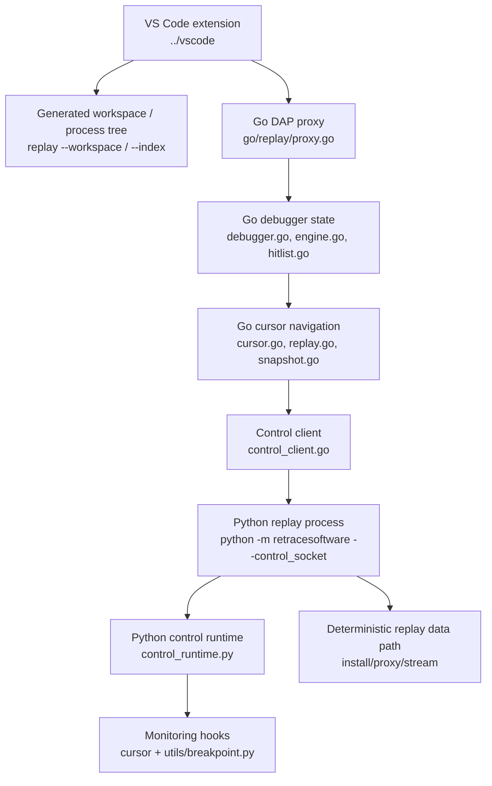
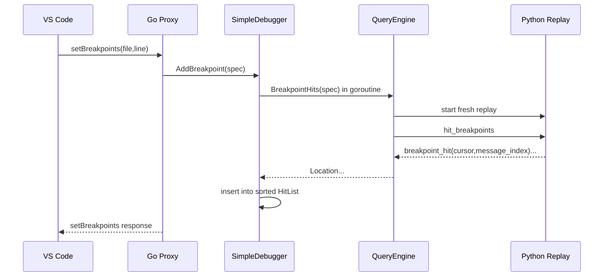
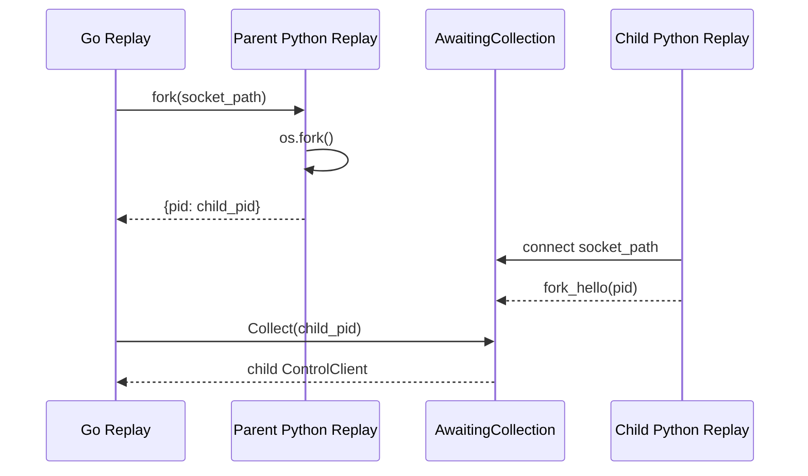

# Retrace Debugger Design

This document describes the debugger stack that sits on top of Retrace record
and replay. It is intended for maintainers who need to change VS Code
integration, DAP behavior, replay navigation, breakpoint scanning, or the
Python control runtime.

For debugging symptoms and operational flags, see `docs/DEBUGGING.md`.
For cursor internals, see `docs/cursors.md`.

## Scope

The current VS Code debugging path is:

1. A `.retrace` recording is opened by the VS Code extension.
2. The extension launches the Go replay binary as a DAP adapter.
3. The Go DAP proxy starts one or more Python replay subprocesses.
4. Go talks to each Python replay subprocess over a line-delimited JSON
   control protocol on Unix sockets.
5. The Python control runtime installs breakpoint, cursor, return, and
   instruction monitors in the deterministic replay process.
6. Stop locations are converted back into DAP stack frames, scopes, source
   paths, and variables for the editor.

There is also an older Python DAP adapter under `src/retracesoftware/dap/`.
It is conceptually related and still tested, but the VS Code time-travel
recording flow currently uses the Go-owned DAP proxy in `go/replay/proxy.go`.

## Layer Map



The debugger control plane is intentionally separate from replay data-plane
I/O. Control sockets, DAP streams, and internal fork sockets must bypass
Retrace interception; otherwise the debugger would record or replay its own
control traffic.

## Main Artifacts

### Recording

The `.retrace` file is the top-level multi-process trace. It has a shebang
pointing at the replay binary:

```text
#!/path/to/replay --recording
```

The VS Code extension reads that shebang in `../vscode/src/trace.ts` to find
the correct replay binary for this recording.

### PidFile

A PidFile is a linearized per-process replay file extracted from a `.retrace`
recording. It contains a process preamble followed by the raw process stream.
The Go DAP proxy eventually debugs a PidFile, not the entire multi-process
trace directly.

The Go command supports both routes:

```text
replay --recording trace.retrace --dap [--pid N]
replay --dap trace.d/12345.bin
```

When DAP mode receives a `.retrace` recording, `ensureExtracted` creates or
reuses `trace.d/index.json` and `trace.d/<pid>.bin`.

### Process Index

`replay --recording trace.retrace --index` returns a JSON process tree. Each
process node contains:

- `pid`
- `type` (`exec` or `fork`)
- `preamble`
- `segments`
- `children`
- fork metadata for fork children

The VS Code sidebar uses this index to show the process tree and to start a
debug session for a selected process.

### Generated Workspace

`replay --recording trace.retrace --workspace` writes a `.code-workspace`
beside the recording. `GenerateWorkspace` derives workspace folders from
recorded process working directories and writes a launch configuration:

```json
{
  "type": "retrace",
  "request": "launch",
  "name": "Retrace",
  "recording": "/absolute/path/to/trace.retrace"
}
```

The workspace also stores `retrace.recording`, which lets the VS Code extension
autoload the process tree.

## VS Code Extension Layer

The active extension project is the sibling repo at `../vscode`.

Important files:

- `package.json` contributes debug type `retrace`.
- `src/extension.ts` registers the debug adapter descriptor factory, the DAP
  tracker, the recording sidebar, and commands.
- `src/debugAdapter.ts` creates a `DebugAdapterExecutable`.
- `src/processTree.ts` calls `replay --index` and renders the process tree.
- `src/workspace.ts` calls `replay --workspace` and opens the generated
  workspace.
- `src/trace.ts` extracts the replay binary path from the trace shebang.

Launch path:

1. User opens a `.retrace` file or a generated workspace.
2. The extension resolves the replay binary from the recording shebang.
3. VS Code starts the binary as the DAP adapter:

   ```text
   replay --recording /path/to/trace.retrace --dap [--pid N]
   ```

4. If `retrace.debugProtocol` is enabled, the extension sets
   `RETRACE_DEBUG_PROTOCOL=1`.
5. The extension tracker logs DAP messages in the extension log.

The extension does not implement DAP semantics. It delegates DAP execution to
the Go replay binary.

## Go Replay Binary Layer

`go/cmd/replay/main.go` is the executable entry point. In debugger mode it has
three responsibilities:

1. Select the requested recording or PidFile.
2. Extract a recording to PidFiles when necessary.
3. Run `replay.NewProxy(...).Run()` as the DAP adapter on stdin/stdout.

In DAP mode, Go logs are written through `DAPLogWriter`, which turns log lines
into DAP `output` events. This is why protocol logs appear in the VS Code Debug
Console instead of corrupting the DAP stream.

## DAP Wire Layer

DAP messages are framed with `Content-Length` headers. `go/replay/codec.go`
owns this framing and provides:

- `ReadMessage`
- `WriteMessage`
- thread-safe `Writer`
- `DAPLogWriter`

The Go proxy handles a subset of DAP:

- lifecycle: `initialize`, `launch`, `configurationDone`, `disconnect`
- breakpoints: `setBreakpoints`
- threads: `threads`
- execution: `continue`, `reverseContinue`, `next`, `stepIn`, `stepOut`,
  `stepBack`
- inspection: `stackTrace`, `scopes`, `variables`, `source`, `evaluate`

`evaluate` currently returns a placeholder. `threads` exposes one logical DAP
thread id, `1`, even though replay cursors carry stable internal thread ids.

### DAP Event Ordering

The current event shape is:

1. `initialize` request -> initialize response and `initialized` event.
2. `launch` request -> Go starts Python replay/control process -> launch
   response.
3. `configurationDone` -> response -> `stopped` event with reason `entry`.
4. `continue` or step request -> response -> later `stopped` or `terminated`.

This ordering is client-visible and should be treated as a contract.

## Go DAP Proxy

`go/replay/proxy.go` maps DAP requests onto replay/debugger operations.

Important proxy state:

- `pidFile`: the extracted process file being debugged.
- `recordingDir`: parent recording/extraction directory, used for source
  resolution.
- `processCWD`: the recorded process cwd from the PidFile preamble.
- `debugger`: stateful breakpoint manager.
- `provider`: snapshot provider used by cursors.
- `breakpointIDs`: DAP breakpoint identity map.
- `currentMessageIndex`: the current trace message index for continue and
  reverse continue.
- `currentCursor`: the current replay location.
- `navigatedFromHit`: distinguishes a cursor moved by stepping from a cursor
  still sitting on a breakpoint hit.

### Launch

`handleLaunch` starts the first Python replay process:

```text
StartReplayFromPidFile
  -> ReadProcess(pidFile)
  -> targetFromProcess
  -> StartReplay
  -> StartControlProcess
  -> python -m retracesoftware --recording <pidfile> --control_socket <sock>
  -> hello
```

The initial replay process becomes the root snapshot source for later forks.

### Source Resolution

DAP stack frames need editor-openable paths. Python frames may report relative
`co_filename` values, so `resolveSourcePath` uses:

1. absolute path as-is
2. `processCWD + filename`, if it exists
3. `recordingDir + filename`, if it exists
4. `processCWD + filename`, even if missing
5. local absolute fallback

The recorded cwd is the canonical base because it is authored by the target
process, not by the debugger.

## Go Debugger And Breakpoint Scanning

The `Debugger` interface is intentionally small:

```go
AddBreakpoint(ctx, spec) (id, error)
RemoveBreakpoint(id)
Hits() *HitList
WaitForScans(ctx) error
Close() error
```

`SimpleDebugger` owns stateful bookkeeping:

- breakpoint ids
- cancellation functions
- scan goroutines
- a merged `HitList`

`SimpleQueryEngine` performs the actual query. For each breakpoint it starts a
fresh Python replay subprocess and asks it to run `hit_breakpoints`.



The hit list is sorted by trace `message_index`. `continue` waits for scans to
finish, then selects the next hit after the current message index. If no hit is
available, the proxy emits `terminated`.

### Breakpoint Materialization

The scan process finds possible hits, but the interactive debug session needs a
live stopped replay process for stack/locals/source queries. When `continue`
chooses a hit, the proxy materializes it:

1. Ask the snapshot provider for a replay before the hit.
2. Fork a replay from that snapshot.
3. Send `hit_breakpoints` with `max_hits=1`.
4. Store the returned `Location` and `Replay` in `currentCursor`.
5. Emit DAP `stopped` with reason `breakpoint`.

This means inspection happens in a replay process that is actually stopped at
the selected program point.

## Cursor And Location Model

Go uses `Location` as its debugger position type:

```go
type Location struct {
    ThreadID       uint64
    FunctionCounts FunctionCounts
    FLasti         *int
    Lineno         int
    MessageIndex   uint64
}
```

`FunctionCounts` is a per-frame call-count path through the execution tree.
Together with `f_lasti`, it can identify a bytecode instruction inside a
specific invocation of a specific function.

The protocol-level form is `RawCursor`:

```json
{
  "thread_id": 1,
  "function_counts": [1, 10, 1, 5],
  "f_lasti": 34,
  "lineno": 8
}
```

`message_index` is not part of `RawCursor`, but Go attaches it to `Location`
when a control stop reports the current trace position.

## Replay, Snapshots, And Forking

`Replay` owns a running Python replay subprocess and its control socket. It can
send commands such as:

- `hit_breakpoints`
- `run_to_cursor`
- `run_to_return`
- `next_instruction`
- `instruction_to_lineno`
- `stack`
- `locals`
- `source_location`
- `fork`

`Snapshot` is a checkpoint abstraction. Today `SimpleSnapshotProvider` is
seeded with a single root snapshot, and `Snapshot.Replay()` forks that root
process. The interface is deliberately broader so later implementations can add
more checkpoints without changing cursor navigation callers.

Forking works like this:



The child process inherits the replay state at the fork point. The Python
control runtime discards inherited watches in the child and reconnects the
control socket, so parent and child can accept commands independently.

## Python Replay Entrypoint

`src/retracesoftware/__main__.py` owns replay startup.

When `--control_socket` or `--stdio` is present:

1. Open the recording/PidFile with `open_tape_reader`.
2. Validate Retrace checksums and exact Python version.
3. Create the replay `System` via `replayer(...)`.
4. Wrap the tape reader so every read calls `controller.on_new_message`.
5. Connect the control socket.
6. Create `Controller` with:
   - `disable_for=system.disable_for`
   - `get_thread_id=system.thread_id`
   - fork callbacks that save/reopen the tape reader offset
7. Run the recorded Python command under installed replay patches.
8. Call `controller.on_replay_finished()` at EOF.

The checksum gate is intentional. If code or the replay binary changes, old
recordings must be regenerated unless `RETRACE_SKIP_CHECKSUMS=1` is used for a
temporary debug escape hatch.

## Python Control Protocol

The control protocol is line-delimited JSON on a Unix socket. It is not DAP.
Go speaks DAP to the editor and speaks this smaller protocol to Python.

Request:

```json
{"id":"req-1","method":"hello","params":{}}
```

Success response:

```json
{"id":"req-1","ok":true,"result":{"protocol":"control","version":1}}
```

Event:

```json
{"id":"req-2","kind":"event","event":"breakpoint_hit","payload":{...}}
```

Stop:

```json
{
  "kind": "stop",
  "payload": {
    "reason": "cursor",
    "message_index": 1493,
    "cursor": {...},
    "thread_cursors": {}
  }
}
```

### Control Commands

| Command | Purpose | Result shape |
|---|---|---|
| `hello` | protocol handshake | ok response |
| `hit_breakpoints` | run until matching breakpoint hits | `breakpoint_hit` events, then ok/stop |
| `run_to_cursor` | run until function counts and optional `f_lasti` match | stop reason `cursor` |
| `run_to_return` | run until target frame returns | `cursor` events, then stop reason `return` |
| `next_instruction` | stop on next user bytecode instruction | stop reason `instruction` |
| `instruction_to_lineno` | return bytecode offset to source-line table | ok response |
| `stack` | inspect stopped call stack | ok response |
| `locals` | inspect stopped frame locals | ok response |
| `source_location` | inspect stopped frame source path and line | ok response |
| `set_backstop` | set message-index stop guard | ok response |
| `wait_for_thread` | wait for control to reach target thread | ok response |
| `fork` | fork current replay process and reconnect child control socket | ok response plus child `fork_hello` |
| `close` | close control loop | ok response |

## Python Controller Intent Loop

`control_runtime.Controller` is a small interpreter around a generator
(`control_event_loop`). The generator reads requests and yields intents:

- `StopAtBreakpoint`
- `StopAtCursor`
- `RunToReturn`
- `NextInstruction`
- `WaitForThreadChange`

The controller translates each intent into installed monitoring hooks. When a
hook fires, the controller sends the cursor or reason back into the generator,
which writes a protocol response/event/stop.

This split keeps protocol parsing separate from low-level monitoring mechanics.

## Python Monitoring Primitives

The debugger relies on Python 3.12 `sys.monitoring` for precise and low
overhead stops.

### Breakpoints

`src/retracesoftware/utils/breakpoint.py` installs file/line breakpoints:

1. Compile a `BreakpointSpec`.
2. Install the call counter.
3. Register a `PY_START` callback to enable local `LINE` events for matching
   code objects.
4. Register a `LINE` callback that checks the live frame line and condition.
5. Call back with `cursor_snapshot().to_dict()`.

The file predicate avoids live `os.path.realpath` during replay after
compilation. This matters because filesystem calls may be proxied and could
desynchronize replay if invoked from the debugger itself.

Function breakpoints use `CALL` events and compare the callee by identity.

### Cursor Stops

`register_cursor_callback` supports two forms:

- Function-count-only cursor: arm `cursor.watch(..., on_start=callback)`.
- Function-count plus `f_lasti`: wait for matching counts, then use an
  instruction monitor and stop only when `offset == f_lasti`.

This is the precision mechanism behind `run_to_cursor`.

### Return Stops

`RunToReturn` installs a watch on `on_return` for the target function counts.
When it fires, the controller writes a final stop reason `return`. Optional
`max_call_counter` can stop when a child call count limit is reached.

### Next Instruction

`NextInstruction` installs an `INSTRUCTION` monitor in the current OS thread.
It skips:

- Retrace internal code
- pseudo-files such as `<...>`
- the starting offset once

It returns a cursor with current call counts, `f_lasti`, and computed line
number.

## Stepping Semantics

The DAP proxy maps stepping commands to `Cursor` methods.

| DAP command | Go method | Python primitive | User-visible stop |
|---|---|---|---|
| `next` | `Cursor.Next` | repeated `next_instruction`, return out of child calls | next different source line in same frame |
| `stepIn` | `Cursor.StepInto` | `run_to_cursor` to child counts, then advance off entry line | first executable line in callee |
| `stepOut` | `Cursor.Return` | `run_to_return`, then `next_instruction` | caller frame after callee returns |
| `stepBack` | `Cursor.PreviousStatement` | instruction lineno table or replay-from-snapshot fallback | previous source line |
| `reverseContinue` | hit list search | no new Python primitive | previous breakpoint hit |

### Step Over

`Cursor.Next` advances by repeatedly calling `AdvanceToNextFrameInstruction`
until the source line changes. If a `next_instruction` enters a child call,
`AdvanceToNextFrameInstruction` runs to that child's return and then advances
once in the parent. This is what makes it a step-over rather than step-into.

### Step Into

At a call site with function counts `[a, b, c]`, the next child call starts at:

```text
[a, b, c+1, 0]
```

`StepInto` computes that target, runs to the cursor, then advances from the
function definition/entry line to the first executable line when possible.

### Step Out

`Return` runs to the current frame's return and then advances one instruction
in the parent. The top DAP frame is the caller frame.

### Step Back

`PreviousStatement` first tries a same-frame fast path:

1. Ask Python for the current code object's instruction line table.
2. Find the closest earlier instruction with a different source line.
3. Rewind to the first instruction for that line in the same frame.

If the fast path cannot resolve a location, the fallback uses
`BackwardsSteps`: replay from a snapshot to earlier call-count boundaries,
step forward to the current cursor, and yield the intermediate instructions in
reverse order.

## Inspection Semantics

Inspection requires a live Python replay process stopped at the cursor.
`Cursor.ensureReplay` either reuses the cached `Replay` or materializes one by
forking from the nearest snapshot and running to the cursor.

DAP inspection requests map as follows:

- `stackTrace` -> Python `stack`
- `scopes` -> currently one locals scope
- `variables` -> Python `locals`
- `source` -> Go reads resolved source path
- `evaluate` -> currently placeholder

`FrameInspector` is pause-scoped. Once execution resumes, frame-backed object
identity should be considered invalid.

## Control-Plane Safety Rules

These rules are correctness requirements:

1. DAP and control sockets must not be recorded as application I/O.
2. Monitoring callbacks must be wrapped with both replay-system disable gates
   and cursor call-counter disable gates.
3. Breakpoint and cursor callbacks must not call live nondeterministic
   filesystem, network, clock, RNG, or threading surfaces unless they are
   explicitly outside retrace gates.
4. Replay control I/O must not perturb call counts. The controller composes
   `cursor.call_counter_disable_for` with `system.disable_for` for this reason.
5. Source path resolution may use live `os.Stat` on the Go side, outside the
   replayed Python process. It must not be moved into Python replay hooks.
6. Stop reasons, DAP event ordering, cursor payload shape, and `message_index`
   semantics are client-visible contracts.

## Failure Modes And Diagnostics

### Checksum Mismatch

Python replay compares recorded Retrace checksums against current code and the
embedded replay binary. A mismatch means the recording was made against a
different runtime. Regenerate the recording for normal validation.

### Missing Debug Adapter Descriptor

VS Code did not load an extension that contributes debug type `retrace` or did
not register the descriptor factory. The active extension is `../vscode`; its
`package.json` has the `debuggers` contribution and `src/extension.ts`
registers the factory.

### Breakpoint Does Not Hit

Check:

- The breakpoint source path matches the recorded process source path.
- The recording was generated under Python 3.12+ for `sys.monitoring`.
- `setBreakpoints` verified the breakpoint.
- Breakpoint scans completed and populated the hit list.
- The recording checksum matches current code.

### Step Hangs Or Stops On Internal Code

Check:

- `RETRACE_DEBUG_PROTOCOL=1` control logs.
- `next_instruction` logs and stop payload.
- Whether the monitor is stopping in Retrace internal files.
- Whether `Replay.location` and `Cursor.location` stayed synchronized.

### Source File Not Found

Check `resolveSourcePath` behavior. Relative paths should resolve against the
recorded `cwd` first, not the developer's current shell cwd.

## Test Coverage

Primary tests:

- `go/replay/dap_e2e_test.go`
  - Drives a real in-process DAP client through initialize, launch,
    breakpoints, continue, stackTrace, `next`, `stepBack`, `stepIn`, and
    `stepOut`.
- `go/replay/stdio_breakpoint_test.go`
  - Exercises Python replay control commands over stdio.
- `tests/test_stdio_replay.py`
  - Exercises `hit_breakpoints` protocol behavior.
- `tests/test_run_to_cursor.py`
  - Exercises `run_to_cursor`, `run_to_return`, and `next_instruction`.
- `tests/test_run_to_return.py`
  - Unit-level coverage for return watches.

Useful commands:

```bash
cd go && go test ./...
.venv312/bin/python -m pytest tests/test_stdio_replay.py tests/test_run_to_cursor.py -q
```

For VS Code-style manual validation:

```bash
(cd go && go build -o ../src/retracesoftware/replay/replay ./cmd/replay)
.venv312/bin/python -m retracesoftware --recording vscode-workspace-test-py312/target_hello.retrace -- examples/target_hello.py
src/retracesoftware/replay/replay --recording vscode-workspace-test-py312/target_hello.retrace --extract vscode-workspace-test-py312/target_hello.d
src/retracesoftware/replay/replay --recording vscode-workspace-test-py312/target_hello.retrace --workspace
```

Open the generated `.code-workspace`, set breakpoints in the original source
path, and run the `Retrace` launch configuration.

## Current Limitations

- The Go DAP proxy supports one logical DAP thread id.
- `evaluate` is a placeholder in the Go proxy.
- `SimpleSnapshotProvider` currently keeps only the root snapshot; more
  snapshots would improve navigation latency.
- Breakpoint scans currently run whole-trace queries before `continue`
  consumes the hit list.
- The Python DAP adapter under `src/retracesoftware/dap/` is not the primary
  VS Code recording debugger path and can drift unless changes are checked
  against `go/replay/`.

## Change Checklist

When changing debugger behavior:

1. Identify whether the change belongs in the editor, Go DAP proxy, Go cursor
   navigation, Python control runtime, or lower replay data path.
2. Keep control-plane I/O outside recorded application I/O.
3. If DAP event order or payload shape changes, update DAP tests in the same
   diff.
4. If cursor semantics change, update `docs/cursors.md` and the Go/Python
   control tests.
5. If source path resolution changes, verify generated workspaces and stack
   frame paths.
6. If Python hooks change, test under Python 3.12+ and check `sys.monitoring`
   behavior.
7. Regenerate any manual recordings after changing checksummed files or the
   replay binary.
