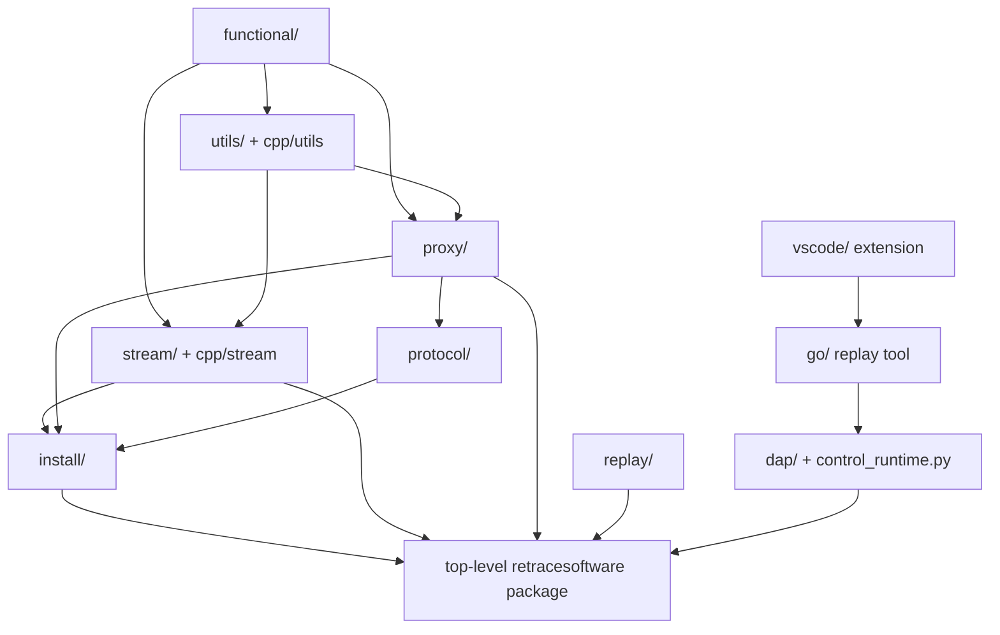

# Retrace Module Layers

Retrace is split into small layers. Dependencies should keep flowing from
low-level utility code toward orchestration code; lower layers should not import
higher layers.

The diagram is a mental model rather than a complete import graph. The rule of
thumb is simple: do not make serialization code know about VS Code, do not make
proxy policy depend on the CLI, and do not make runtime patching depend on
debugger UI behavior.

## `functional`

Low-level functional helpers with native implementations and Python fallbacks.
This layer should stay general-purpose and dependency-light.

## `utils`

CPython helper code and native utilities. This layer contains low-level tools
for type flags, gates, call counters, breakpoints, hashing, and other runtime
mechanics used by higher layers.

## `stream`

Trace serialization and replay reading. The stream layer knows how to write and
read values, bindings, handles, thread markers, heartbeats, and queue-backed
recording data. It does not decide which application behavior is external.

The native implementation lives under `cpp/stream/`.

## `proxy`

The record/replay boundary layer. `proxy/` defines how calls cross between
retraced deterministic code and external nondeterministic code. It owns gates,
system contexts, proxy types, binding/checkpoint behavior, and IO message
routing.

Read `src/retracesoftware/proxy/DESIGN.md` before changing this layer.

## `protocol`

Semantic replay protocol objects layered above the stream transport. This layer
keeps higher-level replay message shapes separate from low-level byte encoding.

## `install`

Runtime wiring and patching. `install/` loads module TOML configs, patches
already-loaded modules, installs import hooks, wraps thread-start paths, and
connects concrete stream readers/writers to proxy systems.

This layer is where external library coverage becomes live Python behavior.

## Top-Level `retracesoftware`

The package root owns orchestration:

- `__main__.py` for CLI record/replay/install/uninstall
- `autoenable.py` and `retracesoftware_autoenable.pth` for `.pth` startup
  activation
- `tape.py` for recording preambles, checksums, shebangs, and tape open helpers
- `run.py` for running recorded Python scripts/modules
- `threadid/` for stable top-level thread-id helpers

This layer assembles record and replay but should avoid duplicating lower-layer
proxy, stream, or install behavior.

## Replay, Debugger, And Editor Layers

`src/retracesoftware/replay/` locates or lazily builds the Go replay binary.

`go/` owns user-visible replay tooling:

- `.retrace` indexing
- extraction into PidFiles
- direct PidFile replay launch
- workspace generation
- DAP proxy mode

`src/retracesoftware/control_runtime.py` and `src/retracesoftware/dap/` support
Python-side debugger control and DAP-related replay behavior.

`vscode/` is the editor integration. It opens `.retrace` files, renders the
recorded process tree, and launches the Go replay binary as the debug adapter.

## Design Principles

| Principle | Where it shows up |
|---|---|
| Lower layers stay reusable | `functional`, `utils`, and `stream` do not know about user workflows. |
| Proxy owns boundary semantics | `proxy` decides record/replay behavior through abstract reader/writer protocols. |
| Install wires policy to Python | `install` applies module configs and runtime patches. |
| CLI is orchestration | `__main__.py`, `autoenable.py`, and `tape.py` assemble the workflow. |
| Go owns recording tooling | extraction, indexing, workspace generation, and VS Code DAP launch live in `go/`. |
| Editor UI stays outside replay data | VS Code and DAP control traffic must not be recorded as application I/O. |

When a change crosses multiple layers, the commit or PR description should say
which contract required the cross-layer change. Prefer narrow changes in the
responsible layer.
