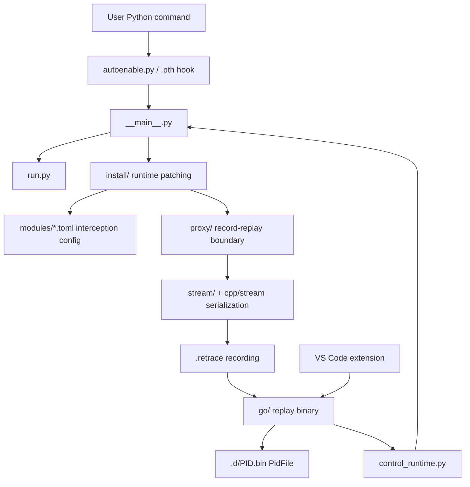

# Architecture

Retrace records boundary crossings and replays them later through the same
Python code.

The core idea:

- deterministic Python code runs during both record and replay
- nondeterministic external behavior is intercepted at configured boundaries
- record mode executes the external behavior and writes the result to the trace
- replay mode returns the recorded result instead of touching live external
  state

Replay correctness depends on that last point. If replay reaches the real
filesystem, network, clock, RNG, process table, model loader, or other
nondeterministic boundary for a recorded external result, the boundary coverage
is incomplete or the replay path is wrong.

## Main Layers



## Auto-Enable And Re-Exec

`python -m retracesoftware install` installs
`retracesoftware_autoenable.pth` into the active Python environment. On a fresh
Python startup, the `.pth` file imports `retracesoftware.autoenable`.

Auto-enable is intentionally environment-driven:

- `RETRACE_RECORDING=<path>` records to a specific file.
- `RETRACE_CONFIG=<name-or-path>` loads a config preset or config file.
- if neither variable is set, Python startup continues normally.

When recording is enabled, `autoenable.py` prepares the target `.retrace` file
and re-executes Python as:

```
python -m retracesoftware --recording <path> -- <original command>
```

The internal `RETRACE_INODE` guard prevents recursive re-exec of the same
recording path.

## Recording Path

1. A user runs an ordinary Python command with `RETRACE_RECORDING` set.
2. The `.pth` hook imports `retracesoftware.autoenable`.
3. `autoenable.py` prepares the `.retrace` file and re-execs Python through the
   Retrace CLI.
4. `src/retracesoftware/__main__.py` builds a recorder system and tape writer.
5. `src/retracesoftware/install/` patches configured runtime and library
   surfaces.
6. `src/retracesoftware/run.py` runs the original Python command.
7. External calls cross the `proxy/` boundary, execute live, and write messages
   to `stream/`.
8. `src/retracesoftware/tape.py` writes the recording preamble, checksums,
   environment, Python version, command, and boundary-call stream.

Explicit recording through `python -m retracesoftware --recording ... --
<target>` uses the same recorder path without relying on the `.pth` hook.

## Recording Files And PidFiles

A `.retrace` file is a multi-process recording container with a replay-tool
shebang plus metadata and trace bytes. The Go replay tool can extract it:

```
./recordings/app.retrace --extract
```

Extraction writes:

```
recordings/app.d/index.json
recordings/app.d/PID.bin
```

The `.d/PID.bin` files are per-process PidFiles. The current Python replay path
expects the unframed per-process PidFile form, not an old trace-format
compatibility layer.

## Replay Path

1. The Go replay binary extracts or indexes a `.retrace` recording.
2. Replaying a PidFile launches Python as:

   ```
   python -m retracesoftware --recording recordings/app.d/PID.bin
   ```

3. `__main__.py` validates the recorded Python version and Retrace checksums.
4. Replay restores recorded `sys.path`, environment, and working-directory
   context.
5. The same Python command runs again.
6. External calls are intercepted, but replay reads their recorded results from
   the PidFile instead of executing them live.

`RETRACE_SKIP_CHECKSUMS=1` bypasses checksum validation as a debugging escape
hatch only. Normal validation should keep checksum and Python-version checks on.

## Boundary Configuration

Built-in interception configs live in:

```
src/retracesoftware/modules/
```

They describe which functions, types, and methods are treated as record/replay
boundaries. Examples include stdlib behavior, random number generation, SQLite,
OpenSSL, NumPy random, psutil, Hugging Face downloads, and llama.cpp model
boundaries.

Configs are TOML files. They can describe a single module or a package with
multiple module sections. Common directives include:

- `proxy` for functions that should execute during record and return recorded
  results during replay
- `ext_proxy_result` for extension/native calls with external results
- `bind` for functions that return objects requiring stable replay bindings
- `immutable` for values that can be reused as deterministic values
- `disable` for calls that must not run
- `wrap` and `stub_for_replay` for edge cases that need Python helper code
- `sync` for explicit synchronization checkpoints

User configs can be loaded from `.retrace/modules/` or `RETRACE_MODULES_PATH`.
When changing boundary behavior, read `src/retracesoftware/modules/AGENTS.md`
and the proxy design contract in `src/retracesoftware/proxy/DESIGN.md`.

## Thread Replay

Retrace does not replay live scheduler decisions. It records a single ordered
message stream and marks logical thread switches. Replay demultiplexes that
stream by logical thread id so each replay thread receives the messages that
belonged to the corresponding recorded thread.

The main implementation points are:

- `src/retracesoftware/proxy/system.py` assigns replay logical thread ids.
- `src/retracesoftware/proxy/io.py` emits and consumes thread-switch markers.
- `src/retracesoftware/stream/reader.py` supports thread-aware stream reading.

See [Thread Replay](../THREAD_REPLAY.md) for details.

## VS Code Debugging Path

1. The VS Code extension opens a `.retrace` file.
2. `vscode/src/trace.ts` reads the recording shebang to find the replay binary.
3. `vscode/src/processTree.ts` calls:

   ```
   replay --recording <recording> --index
   ```

4. Starting a debug session launches:

   ```
   replay --recording <recording> --dap [--pid N]
   ```

5. The Go DAP proxy starts Python replay subprocesses.
6. Go talks to Python through the control protocol implemented in
   `src/retracesoftware/control_runtime.py`.
7. Python replay runs deterministically while debugger commands control
   breakpoints, stepping, stack frames, and variables.

Debugger control-plane I/O must stay outside Retrace application I/O. If the
debugger's own sockets, pipes, or commands are recorded as application behavior,
the tool can interfere with its own replay.

## Go Replay Tool

The Go binary in `go/cmd/replay/` owns user-visible recording tooling:

- `--index` process tree JSON
- `--extract` PidFile extraction
- `--workspace` VS Code workspace generation
- `--dap` debug adapter proxy mode
- direct PidFile replay launch
- roundtrip helper flows used by tests and debugging

Supported wheels include this binary under `retracesoftware/replay/replay`. In
source checkouts, it can be built lazily if missing.

## Where To Read Next

- [Debugger Design](../DEBUGGER_DESIGN.md)
- [Stream Architecture](../STREAM.md)
- [Thread Replay](../THREAD_REPLAY.md)
- [Cursors](../cursors.md)
- [Debugging Retrace](../DEBUGGING.md)
