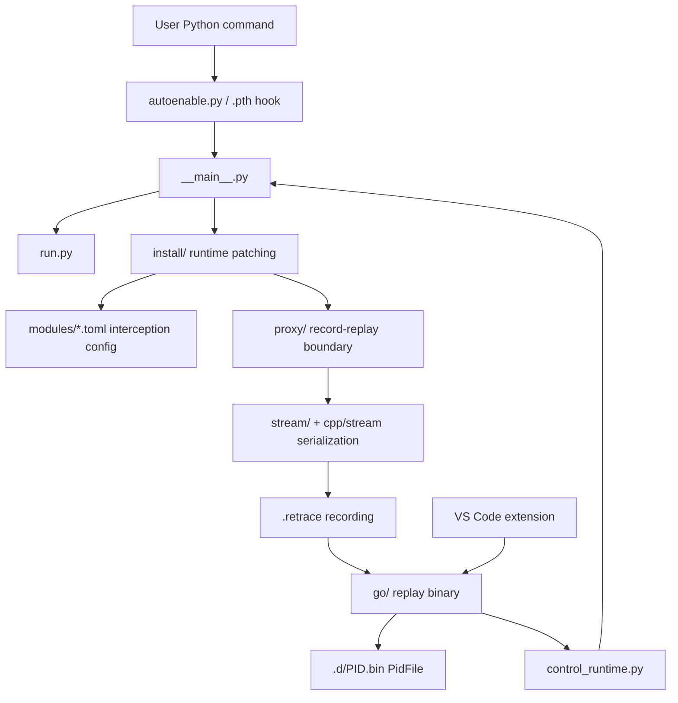

# Architecture

Retrace records boundary crossings and replays them later through the same
Python code.

The core idea:

- deterministic Python code runs during both record and replay
- nondeterministic external behavior is intercepted at configured boundaries
- record mode executes the external behavior and writes the result to the trace
- replay mode returns the recorded result instead of touching live external
  state

## Main Layers



## Recording Path

1. A user runs a Python command with `RETRACE_RECORDING` set.
2. `retracesoftware_autoenable.pth` imports `retracesoftware.autoenable`.
3. `autoenable.py` prepares the `.retrace` file and re-execs Python as:

   ```
   python -m retracesoftware --recording <path> -- <original command>
   ```

4. `src/retracesoftware/__main__.py` builds a recorder system and tape writer.
5. `src/retracesoftware/install/` patches configured runtime and library
   surfaces.
6. `src/retracesoftware/run.py` runs the original Python command.
7. External calls cross the `proxy/` boundary, execute live, and write messages
   to `stream/`.
8. `src/retracesoftware/tape.py` writes the recording preamble, checksums,
   environment, Python version, command, and boundary-call stream.

## Replay Path

1. The `.retrace` file is extracted by the Go replay binary:

   ```
   ./recordings/app.retrace --extract
   ```

2. Go writes:

   ```
   recordings/app.d/index.json
   recordings/app.d/PID.bin
   ```

3. Replaying a PidFile launches Python as:

   ```
   python -m retracesoftware --recording recordings/app.d/PID.bin
   ```

4. `__main__.py` validates the recorded Python version and Retrace checksums.
5. Replay restores recorded `sys.path`, environment, and working-directory
   context.
6. The same Python command runs again.
7. External calls are intercepted, but replay reads their recorded results from
   the PidFile instead of executing them live.

## VS Code Debugging Path

1. The VS Code extension opens a `.retrace` file.
2. `vscode/src/trace.ts` reads the recording shebang to find the replay binary.
3. `vscode/src/processTree.ts` calls:

   ```
   replay --recording <recording> --index
   ```

4. Starting a debug session launches:

   ```
   replay --recording <recording> --dap [--pid N]
   ```

5. The Go DAP proxy starts Python replay subprocesses.
6. Go talks to Python through the control protocol implemented in
   `src/retracesoftware/control_runtime.py`.
7. Python replay runs deterministically while debugger commands control
   breakpoints, stepping, stack frames, and variables.

## Module Configs

Built-in interception configs live in:

```
src/retracesoftware/modules/
```

They describe which functions, types, and methods are treated as record/replay
boundaries. Examples include stdlib behavior, random number generation, SQLite,
OpenSSL, NumPy random, psutil, and model/download-related surfaces.

User configs can be loaded from `.retrace/modules/` or `RETRACE_MODULES_PATH`.

## Go Replay Tool

The Go binary in `go/cmd/replay/` owns user-visible recording tooling:

- `--index` process tree JSON
- `--extract` PidFile extraction
- `--workspace` VS Code workspace generation
- `--dap` debug adapter proxy mode
- direct PidFile replay launch

The installed Python package includes this binary under
`retracesoftware/replay/replay`. In source checkouts, it can be built lazily if
missing.

## Where To Read Next

- [Debugger Design](../DEBUGGER_DESIGN.md)
- [Stream Architecture](../STREAM.md)
- [Thread Replay](../THREAD_REPLAY.md)
- [Cursors](../cursors.md)
- [Debugging Retrace](../DEBUGGING.md)
