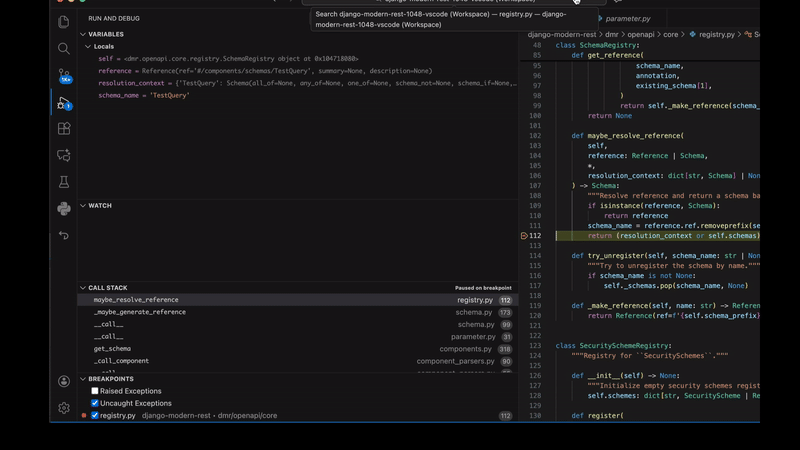

# 002 — django-modern-rest #1048

This internal example documents a real `django-modern-rest` OpenAPI schema
generation bug investigated with Retrace replay.

Issue:

https://github.com/wemake-services/django-modern-rest/issues/1048

## Failure

A `Query[msgspec.Struct]` model containing an `enum.StrEnum` field caused
OpenAPI schema generation to fail with:

```text
KeyError: 'TestEnum'
```

## Runtime Evidence From Replay

Manual VS Code replay showed the relevant caller/failing-frame chain:



The replay shows the `StrEnum` schema reference being carried into parameter
metadata while the later registry lookup has no `TestEnum` entry.

```text
dmr/openapi/generators/parameter.py:73
property_schema = Reference(ref="#/components/schemas/TestEnum")

dmr/openapi/core/registry.py:112
schema_name = "TestEnum"
resolution_context = None
self.schemas lacks "TestEnum"

=> KeyError: "TestEnum"
```

## Root Cause

`Query[msgspec.Struct]` schema generation used `skip_registration=True`. The
top-level query schema was resolved inline, but nested referenced components
such as `#/components/schemas/TestEnum` were not registered. Later parameter
metadata resolution attempted to resolve that missing component from the global
schema registry.

## Patch

The local patch:

- adds a `register_referenced_components` option to `SchemaGenerator`;
- enables it from `ParameterGenerator`;
- registers nested referenced components while keeping the skipped top-level
  query model inline;
- adds a regression test for `enum.StrEnum` inside a msgspec query model.

Patch file:

```text
fix/patch.diff
```

## Validation

```text
test_str_enum_query_schema: 1 passed
test_msgspec_schema.py: 31 passed
relevant slice: 666 passed, 1814 deselected
full suite excluding Redis backend: 2443 passed, 11 skipped
```

The full suite was also attempted without excluding Redis. Redis-backed
throttling tests failed during setup because local Redis/socket access to
`127.0.0.1:6379` was unavailable.

## Important Limitation

This is a VS Code replay/manual inspection example.

The current agent-facing CLI/MCP inspection surface did record the run and had
cursor/locals available, but it stopped on an earlier internal generated
`TypeError`, not the final useful `KeyError`. Therefore this example should not
be described as an agent/MCP success case.
