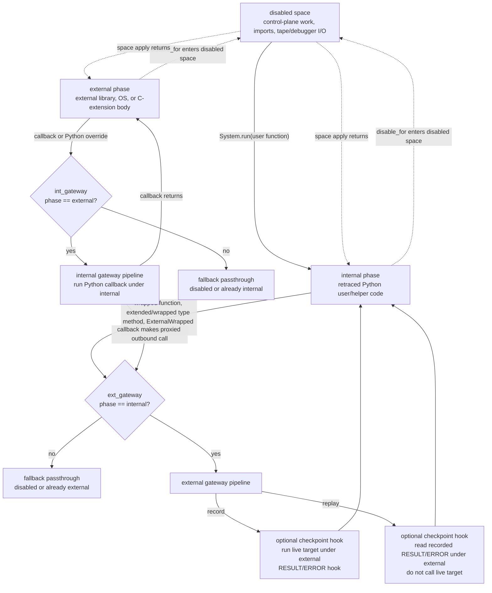

# Proxy Design

## Module Intent

The proxy layer is the record/replay boundary.

- Internal code is deterministic Python code that should run again during replay.
- External code is nondeterministic library, OS, or C-extension behavior that
  must be intercepted.
- Retrace does not snapshot the whole process. It records boundary crossings and
  later replays those crossings while re-executing the Python code around them.

The proxy layer owns these decisions:

- which values cross by value, which values are wrapped, and which values are
  already retrace-aware
- which gateway handles an internal-to-external call or external-to-internal
  callback
- when identity is represented by a binding instead of by value serialization
- how record writes `CALLBACK`, `RESULT`, `ERROR`, checkpoint, scheduling, and
  binding messages
- how replay consumes the same stream without calling live external code

It does not own module discovery, namespace replacement, low-level stream
transport, debugger control-plane I/O, or Go replay tooling. Those layers may
ask proxy-layer semantic questions through the public interface below; they
must not infer proxy behavior from concrete generated types, private
attributes, object identity, or wire-format implementation details.

## Public Interface

The public interface is the small vocabulary other layers may use to ask the
proxy layer for behavior. Prefer these contracts over reaching into the runtime
objects directly.

- `contracts.ProxyRuntime`
  `proxy_type(cls)` returns the type that should replace `cls` in a caller-owned
  namespace. `patch_function(fn)` returns the callable that should replace
  `fn`. The install layer owns the actual namespace mutation.
- `contracts.Binder`
  `bind`, `autobind`, `unbind`, and `__call__` describe explicit identity
  registration and lookup. Binding is a semantic operation; consumers must not
  inspect handle allocation or binder storage.
- `contracts.ImmutableRegistry`
  `add_immutable_type` and `add_immutable_types` declare value types that may
  cross unchanged.
- `contracts.Checkpoint`
  A callable record/replay checkpoint for one application value.
- `contracts.ProxyTypeCustomizer`
  A constrained hook for mutating a generated proxy type after creation. It must
  not perform trace I/O or inspect gateway internals.
- `contracts.ProxyConstructor`
  The value-level constructor shape returned by proxy-constructor factories:
  `object -> Proxy`. It is not a proxy type registry and not a type-to-type
  factory.
- `traceio.TraceReader` / `traceio.TraceWriter`
  The semantic proxy message reader/writer protocols. Raw stream tags are
  decoded into trace message objects before replay logic consumes them.
- `proxy/tape.py`
  The proxy-layer `Tape` / `TapeReader` / `TapeWriter` protocol declarations
  only. The top-level `src/retracesoftware/tape.py` owns recording I/O
  implementation.

`System` is the concrete runtime implementation of these contracts. Adjacent
layers should prefer the protocol shape above, then call `System` only through
its explicit semantic methods such as `record_system`, `replay_system`, `run`,
`disable_for`, `apply_with`, `extend_type`, `wrap_type`, `proxy_type`,
`patch_function`, `add_immutable_type`, and `ext_proxy_result`.

The install-layer module config is also part of the practical public surface.
Its directives are translated into proxy operations such as replacing or
wrapping callables, extending/wrapping types, marking immutable values, binding
exported objects, or live-running local factories with proxied results. See
"Module Config Interface" for the directive-level contract.

Not public:

- `GatewayPair`
- `ProxyFactory`
- `ProxyTypeFactory`
- `TypeExtender`
- generated proxy class private attributes
- concrete `ExternalWrapped` / `InternalWrapped` implementation details
- current stream handle allocation details

Those are implementation mechanisms inside the proxy layer. Focused proxy tests
may assert their behavior, but adjacent layers should not use them to recover
semantic meaning.

## Implementation Map

On the live CLI/runtime path, the important files are `system.py`,
`src/retracesoftware/gateway/_gatewaypair.py`, `proxyfactory2.py`,
`proxytypefactory2.py`, `typeextender.py`, `traceio.py`,
`taggedtraceio.py`, the `Tape` protocols in `proxy/tape.py`, and top-level
`tape.py` recording I/O. Older context/spec helpers were used to wire the same
ideas for tests and transitional code, but they are not the main mental model
for the current runtime.

## Main Pieces

- `System`
  Owns the phase gate, extend/wrap helpers, proxy walkers, binding helpers,
  thread-id tracking, and install-time plumbing.
- `GatewayPair`
  Owns the paired internal/external callable dispatchers. Record wiring runs
  live external calls and observes callback envelopes; replay wiring consumes
  recorded results and replays callbacks without calling live external code.
- `ProxyFactory`
  Owns System-facing proxy construction. It wraps dynamic external type
  generation as a callback, binds the callback identity, and exposes
  `proxy_external`, `proxy_internal`, `proxy_type`, and replay materialization.
- `ProxyTypeFactory`
  Generates the concrete proxy type shapes. Methods that return wrapper
  constructors use the `ProxyConstructor` contract: `object -> Proxy`.
- `System.extend_type()` / `System.wrap_type()`
  Build the retrace type that the install layer should put in the caller-owned
  namespace. Extension is preferred for Python-distribution types; wrapping is
  the fallback for types that cannot be extended safely.
- `stream.Binder`
  Assigns stable handles to live objects and types so later messages can refer
  to them by identity.
- `call_recorder()` / `recorder()` / `replayer()`
  `call_recorder()` builds record-time call/result/callback hooks.
  `recorder()` composes runtime observation such as thread switches, GC, and
  signal callbacks around it. `replayer()` builds replay sources and configures
  matching replay hooks.
- `traceio.py`
  Defines proxy-level trace message types and reader/writer protocols. Raw
  wire tags are decoded into these types before replay logic consumes them.
- `taggedtraceio.py`
  Implements the current tagged wire codec: writer methods emit raw tags and
  the reader decodes raw tags into `traceio.py` message objects.
- `stream.writer` / top-level `create_tape_writer()` / `taggedtraceio.py`
  Provide the record sink for the CLI path. The caller wraps the raw sink in a
  `TraceWriter` before calling `io.recorder()`; the native writer still owns
  multi-value batching, serialization, locking, and reentrancy for trace output.

## Core Runtime Model

## How To Use This Document

Use this file as the proxy behavior contract. Before changing proxy-layer code,
read `src/retracesoftware/proxy/AGENTS.md`, then this document, then compare
the current code to the expected behavior described here.

When a proxy bug or replay mismatch appears, use this document to check the
expected contract before editing code:

1. Identify the intended boundary crossing:
   internal -> external call, external -> internal callback, disabled
   control-plane work, bind/materialization, or thread replay.
2. Identify which phase and gate should be active at that point.
3. Find the fundamental record/replay divergence. The first mismatch in gate,
   phase, binding, message ordering, thread scheduling, or materialization is
   the bug to explain; later dispatcher timeouts, EOFs, or library exceptions
   are usually symptoms.
4. Build the smallest failing regression that reproduces that divergence,
   preferably with stdlib or a tiny local module rather than the full
   dockertest/application that exposed it.
5. Trace the current CLI runtime path from `src/retracesoftware/__main__.py`
   through tape/trace I/O, `system.py`, `GatewayPair`, `proxyfactory2.py`,
   `proxytypefactory2.py`, `typeextender.py`, and `install/`.
6. Only then choose the narrowest responsible fix for the shared contract
   violation.

If you cannot say which design rule is being violated, keep tracing instead of
editing proxy-kernel code.

The current design is centered on retrace-python coordinate spaces:

- `None`
  Retrace is disabled for the current call.
- `'internal'`
  We are executing retraced Python code.
- `'external'`
  We are executing an external call body.

`System` stores those phases in:

- `System.internal_space`
- `System.external_space`
- `System.disabled_space`

Everything else is built around that value:

- `System.enabled()` checks whether retrace is active on this thread.
- `System.location` reports the current phase.
- `System.apply_with(None, callable)` and `disable_for()` run control-plane work
  in the disabled space so it does not retrace itself or perturb coordinates.
- extended type allocation uses the phase-aware gateways so the same
  allocation/result/bind ordering is observed in record and replay.

The two public gateway objects are the `GatewayPair` dispatchers:

- `System.ext_gateway` / `GatewayPair.external`
- `System.int_gateway` / `GatewayPair.internal`

Each dispatcher selects behavior from the active retrace coordinate space. If a
call arrives from the space that owns a boundary crossing, it takes the wired
record/replay path. Otherwise it falls back to transparent unwrapping and
application. `System.run()` executes the top-level user function under the
`'internal'` space so the first proxied outbound call enters the external
gateway instead of falling through as disabled passthrough.

### Space Dispatch Diagram



The phase predicate decides whether a gateway is active. `ext_gateway` only
handles calls that leave retraced Python while the phase is `'internal'`;
`int_gateway` only handles callbacks that re-enter Python while the phase is
`'external'`. `disable_for()` is different: it runs control-plane/runtime work
in retrace-python's disabled space and then returns to the caller's space.

## How The Two Gateways Interact

The most important idea in this design is that the two gateways are not two
independent systems. They are the two directions of the same boundary and they
alternate as control moves back and forth between Python and external code.

### External gateway

The external gateway is used for internal-to-external calls:

- methods on retrace extended/wrapped types
- wrapped standalone functions
- generated external proxy methods

In record mode, `GatewayPair.wire_for_record(...)` builds this shape:

1. unwrap the callable/type token being invoked
2. walk arguments and adapt leaves for the external side, unwrapping existing
   wrappers and creating internal proxies for internal objects that must cross
3. switch to the external space
4. call the real target
5. while still in external space, convert non-passthrough results to external
   proxies and run the result/error hook
6. return the internal-facing value

The record wiring accepts an `unwrap` callable and defaults it to
`utils.try_unwrap`. `System.wire_for_record(...)` supplies a type-aware unwrap
that maps retrace extended types and generated dynamic proxy types back to their
external target type before the external call. This keeps dynamic proxy classes
inside the sandbox boundary and avoids one-off constructor or `__new__`
special cases.

Keeping result proxying inside the external-space call is intentional. If
result adaptation needs to generate a dynamic external proxy type, the
`from_spec` callback is recorded before the enclosing call's `RESULT`.

In replay mode, `GatewayPair.wire_replay(...)` keeps the boundary shape but
replaces the target callable with the supplied `next_result` reader. Replay
walks call arguments the same way record does so materialization context has the
same structure, then reads the next recorded `RESULT` or `ERROR` instead of
executing the live external function.

### Internal gateway

The internal gateway is used for external-to-internal callbacks:

- Python overrides on subclasses of extended types
- internal helper work intentionally routed through retrace

In record mode, `GatewayPair.wire_for_record(...)` builds this shape:

1. keep the callable value intact for callback observation, so a bound wrapper
   crossing the boundary is what the `CALLBACK` envelope records
2. proxy callback arguments into internal-facing values with `ext_proxy`
3. write the callback envelope
4. unwrap the callable only inside the sandbox execution step
5. switch to the internal space and call the Python target
6. adapt the callback result back toward the external side by unwrapping
   existing wrappers, passing immutable values through, and creating internal
   proxies for other internal objects

In replay mode, recorded `CallbackMessage` envelopes are decoded from the trace
and executed under the internal space. The callback completion lookahead only
consumes explicit `CallbackResultMessage` / `CallbackErrorMessage` instances;
ordinary `ResultMessage` / `ErrorMessage` instances remain the enclosing
external call's result.

### The ping-pong between them

The gateways are meant to alternate as control crosses the boundary:

1. Internal Python calls an extended or wrapped type method.
2. That enters the external gateway and switches to `'external'`.
3. External code may call back into a Python override on an extended subtype.
4. That override enters the internal gateway and switches back to `'internal'`.
5. If that callback body makes another outbound external call, control returns
   to the external gateway again.

That back-and-forth is the core semantic model. The current phase tells Retrace
which side is currently executing, while the two gateways determine how values
and hooks are adapted as control crosses the boundary in each direction.

### Hook ownership

Hook ownership follows the gateway direction, not the helper name that happens
to pass the callable around. `GatewayPair` wires the two directions so each
boundary crossing emits or consumes only the messages owned by that direction:

| Gateway | `on_call` source | result/error source | Record messages |
| --- | --- | --- | --- |
| external gateway (`internal` -> `external`) | optional debug/stacktrace observer | external result/error hooks | `RESULT` / `ERROR` |
| internal gateway (`external` -> `internal`) | callback observer | explicit callback completion hooks | `CALLBACK`; optional `CALLBACK_RESULT` / `CALLBACK_ERROR` only when deliberately written |

Replay uses the same ownership split but swaps the hook bodies for message
consumption, checkpoint comparison, and materialization bookkeeping. When
debugging hook changes, reason from the gateway direction first; do not infer
the message type from where the callable is stored.

## Record Versus Replay

Record and replay share the same proxied code paths. The difference is in what
the gateways do once a call reaches them.

### Record

Record mode executes the real external code and writes a description of what
happened.

`io.recorder()` configures:

- binder-backed `on_bind` behavior that emits `NEW_BINDING`
- lifecycle hooks like `ON_START`
- outer-call hooks for `RESULT`, `ERROR`, `CHECKPOINT`, and optional
  `STACKTRACE`
- callback hooks for `CALLBACK`; explicit `CALLBACK_RESULT` and
  `CALLBACK_ERROR` are distinct completion messages, not aliases for the next
  outer `RESULT` / `ERROR`

The important split is:

- the external gateway records the outer call
- the internal gateway records nested callbacks made by that external call

External result proxying is part of the external-space call. If wrapping a live
external result needs to generate a new dynamic external proxy type, the helper
callback for that generation is emitted before the enclosing call writes its
`RESULT` or `ERROR`. The helper is therefore ordered like any other callback
caused by the live external operation.

The callback envelope records the callable that crossed the boundary. If that
callable is a bound `utils.wrapped_function`, the envelope stores that bound
wrapper identity, not the unwrapped Python target. The sandbox call unwraps only
when it actually executes the callback. This keeps callback identity, binding
order, and replay execution aligned for retrace-owned helpers as well as user
callbacks.

So a recorded external operation may write a sequence like:

1. zero or more nested `CALLBACK` envelopes, each optionally followed by an
   explicit `CALLBACK_RESULT` or `CALLBACK_ERROR` when that completion is
   deliberately written
2. `RESULT` or `ERROR`

Record mode is therefore the mode that executes live nondeterministic behavior
and turns it into an ordered message stream.

Replay must preserve that ownership. A plain `RESULT` or `ERROR` after a
callback belongs to the enclosing external call unless the message is explicitly
a `CALLBACK_RESULT` or `CALLBACK_ERROR`. This prevents callback replay from
stealing the outer call result and shifting the stream.

### Record hot path

The record hot path is every operation that runs for each boundary call or each
recorded protocol value. This path must stay in native/combinator code unless a
Python call is the actual application callback or live external behavior being
recorded.

Do not add Python helper functions, lambdas, locks, thread-locals, or gate
wrappers to this path as convenience glue. Prefer the existing native
functional primitives (`functional.sequence`, `functional.partial`,
`functional.repeatedly`, `functional.firstof`, `functional.if_then_else`,
`functional.walker`, `utils.runall`, `utils.thread_switch`, and related
combinators). If the writer is native, it owns serialization, locking, and
reentrancy. If a test or alternate writer is Python, that writer owns any
locking or reentrancy it requires; `io.recorder()` must not compensate by adding
per-message Python scaffolding.

The raw tagged sink contract is `sink(*values)`. On the CLI path,
`src/retracesoftware/__main__.py` passes the native `stream.writer` object to
`tagged_trace_writer(...)`, then passes that semantic `TraceWriter` into
`io.recorder()`. `stream.ObjectWriter.__call__` accepts all positional protocol
values for a logical write and holds the native writer lock for that batch.
Disabled recording mirrors the same callable sink shape with a no-op writer.

Concrete expectations:

- binding payloads are walked with `functional.walker(stream.Binder)`; the
  binder already returns the original object when no binding exists
- thread-switch detection uses the native `utils.thread_switch` monitor with a
  combinator callback, not a Python `last_thread_id` comparison in the write path.
  The native monitor compares CPython thread-state ids rather than raw
  `PyThreadState *` addresses, because short-lived threads may reuse the same
  memory address while still representing distinct logical execution routes.
- on retrace-python, record also installs the public `retrace` eval-loop
  scheduling callback while retraced code is active: switch callbacks write
  `RUN_TO_COORDINATE, <previous coordinate delta>` followed by
  `SWITCH_THREAD, <stable next _thread.get_ident()>`. These tags are
  scheduling telemetry; normal protocol writes still use the writer-bound
  switch monitor for routing.
- `TraceWriter` methods are called directly; do not add a Python lock/batching
  adapter around the native stream writer, and do not wrap the hot writer in
  `disable_for()` unless the writer itself is control-plane Python that must be
  hidden from retrace
- `FastTypePredicate(lambda ...)` is acceptable because the C++ predicate layer
  memoizes by type and calls the Python lambda only on type cache misses

The purpose is both performance and correctness. Extra Python on the record path
adds frames, allocation, lock traffic, and new places to accidentally change
message order. When in doubt, keep the hot path smaller and move policy into the
native writer, binder, predicate, or functional layer that already owns it.

### Replay

Replay mode does not execute live external behavior on the normal path. Instead
it consumes the message stream that record produced.

`io.replayer()` builds a layered replay source:

1. `MessageStream`
2. `BindingStream`
3. `SchedulerStream`
4. `PeekableStream`

That stack gives replay three things at once:

- global message ordering plus cursor-armed scheduler checkpoints
- handle resolution for bound objects
- decoded message objects like `ResultMessage` and `CallbackMessage`

For an outbound external call, replay:

1. enters the external gateway through the same wrapped method/function path
2. emits replay-side call/checkpoint hooks
3. reads replay messages until it reaches the matching `RESULT` or `ERROR`
4. runs any interleaved `CallbackMessage` instances immediately in live Python
5. returns the recorded result instead of calling the real external target

Replay-side argument adaptation must have the same structural shape as record.
Record walks containers and adapts their leaves before an external call; replay
must also walk containers instead of proxying the container object as a whole.
Replay may use those transformed arguments as construction/materialization
context, but it still must not call the live external target.

For callbacks, replay still executes the Python callback body live. What changes
is the external side: replay is driving the boundary from recorded messages
instead of live nondeterministic behavior.

## Debug Checkpoints And Equality

Debug checkpoints and stacktraces are replay-significant guard rails. They are
allowed to add messages, but they must not change application scheduling or
which thread consumes the next protocol item.

Checkpoint comparison is semantic comparison, not raw `==`.

Replay-side `equal()` intentionally normalizes several values that can differ in
live identity while still representing the same boundary event:

- wrapped callables are compared through their underlying target
- `ExternalWrapped` values compare by boundary role/type rather than live object
  identity
- checkpoint payloads can use external proxy markers for generated proxy types
  and `ProxyRef` handles
- materialized replay objects are represented by explicit binding and
  materialization rules, not by record-path unbound-object special cases
- call payload comparison normalizes descriptor receivers and known defaulted
  call shapes such as `_socket.socketpair()`

These normalizations are for detecting real divergence without reporting false
positives from replay-local object identities. They are not a license to ignore
message ordering: a checkpoint still belongs to one logical thread and one exact
place in that thread's message stream.

## Object Categories At The Boundary

Not every value crossing the boundary is treated the same way. A useful mental
model is that Retrace classifies values into a few operational categories.

### 1. Immutable passthrough values

These are values whose type is in `System.immutable_types`.

Examples are things like:

- `int`
- `str`
- `bytes`
- `bool`
- other explicitly configured immutable leaf types

These values cross the boundary by value. They are not wrapped and do not need
binding just to preserve ordinary behavior.

Operationally:

- outbound calls treat them as safe external-call arguments/results
- callbacks treat them as safe internal-call arguments/results
- replay can compare or reconstruct them directly without needing object
  identity

This is the cheapest category and is the baseline "normal Python value"
behavior.

### 2. Internal-proxied values

These are live internal Python objects that cannot safely be handed directly to
external code, so they are wrapped in an `InternalWrapped` dynamic proxy.

This happens on the callback-return / internal-to-external adaptation path,
primarily through `ProxyFactory.proxy_internal` as wired by `System`.

An internal proxy means:

- external code receives a stable wrapper object instead of the original Python
  object
- later calls on that wrapper can re-enter retraced Python through the internal
  gateway
- the wrapper itself may be bound if later messages need to refer to it by
  identity

So "internal proxied" means "this value still logically belongs to the internal
world, but it is being exposed to the external world through a controlled
wrapper."

### 3. External-proxied values

These are live external objects that cannot safely cross into retraced Python as
raw values, so they are wrapped in an `ExternalWrapped` dynamic proxy.

This happens on the external-result / external-to-internal adaptation path,
primarily through `ProxyFactory.proxy_external` as wired by `System`.

An external proxy means:

- internal code receives a wrapper rather than the raw external object
- later method calls on that wrapper route back out through the external gateway
- replay can preserve object identity by binding the logical external object
  instead of trying to serialize the raw live object

So "external proxied" means "this value logically belongs to the external
world, but retraced Python is holding a controlled handle to it."

### 4. Retrace-owned types

Retrace-owned types are generated by `System.extend_type()` or
`System.wrap_type()` and then placed into caller-owned namespaces by the install
layer.

This category is special because these objects are not just "values that may
need wrapping". They already participate in the boundary protocol by virtue of
their retrace type.

There are two current forms:

- `extend_type(cls, python_distribution=...)`
  Creates a retrace-owned subclass of `cls` that inherits `ExtendedType`.
  Instances are already boundary-aware and may cross as themselves.
- `wrap_type(cls)`
  Creates a dynamic external proxy type for classes that cannot be safely
  extended. Instances hold an external target and route methods through the
  external gateway.

That changes the rules:

- methods on extended or wrapped types route through the external gateway
- Python overrides on subclasses of an extended family route through the
  internal gateway
- generated retrace types, generated subtypes, and many instances are bound
  because replay may later need to refer to them by identity
- module namespace replacement does not mutate the original source class; it
  changes which retrace type later imports/use sites see

Generation is type-family oriented. If a later module config explicitly names a
type that already maps to a retrace type in the same `System`, the existing
mapping is reused: generation must not wrap methods twice, emit duplicate
bindings, or change binding order. Conflicting requests for the same source
type with different retrace kinds are errors.

Some attributes are deliberately not generated or wrapped:

- `__new__`
- `__getattribute__`
- `__del__`
- `__dict__`

Those slots are too fundamental or too timing-sensitive to route through the
ordinary method wrapper path. `types.MemberDescriptorType` and
`types.GetSetDescriptorType` are not treated as ordinary callables either; they
are exposed through descriptor proxy types so descriptor access still has the
right boundary shape.

Pre-existing instances of an original source type are not automatically
retrace-owned just because the module binding is later replaced with an
extended or wrapped type. If such an instance is an exported module singleton,
descriptor field, or other stable library object that application code will use
through retrace-owned methods, the responsible module config should bind that
object explicitly. Late discovery during replay is too late: replay will expect
the matching bind marker at the same logical point record emitted it.

`System.extend_type()` creates a retrace-owned subclass instead of mutating the
source type in place. The generated class inherits `ExtendedType`, so instances
are already boundary-aware and may cross as themselves. Its generated `__new__`
routes the original allocation through the external gateway with the final
subtype on a small local stack, then binds the returned instance after the
gateway call if it is an instance of that subtype. `__init__` and ordinary base
methods are wrapped as external calls, while subclass overrides of the original
public method surface are wrapped as callbacks through the internal gateway.
There is no separate replay serialization path for extended `__new__`: replay
consumes the same recorded external result and the post-allocation bind keeps
identity aligned.

Extended type subclass creation is also observable model state. The generated
`__init_subclass__` wraps callback-capable overrides and binds the new subtype
through the same `on_new_type` path used for the generated root extended type.
Record and replay must therefore create and bind extended subtypes in the same
order.

When `ProxyTypeFactory` extends a source type, it also creates and caches a
dynamic external companion for that same source type. Later
`dynamic_external_type(cls)` lookups reuse the companion instead of generating a
second "instantiable" variant. The companion uses the extended class as its
method/attribute surface and reports `__class__` as the extended class, while
still serializing as the dynamic external proxy type token. This lets an
external result whose live type is the original source class be handed back in
the same retrace shape that internal code expects for the extended family.

In practice, retrace-owned values sit between ordinary passthrough values and
ordinary proxied values:

- they are not inert leaf data
- they often should not be wrapped again as though they were unknown objects
- their allocation/binding behavior matters to replay even before a normal
  method result is observed

### Why the distinction matters

These categories drive the proxy walkers in `GatewayPair` and the
`ProxyFactory.proxy_external` / `ProxyFactory.proxy_internal` constructors.

The questions Retrace is really asking for each value are:

1. can this cross by value?
2. is this already a wrapped/bound boundary object?
3. is this part of a retrace-owned type family and therefore already boundary-aware?
4. if not, do we need an internal proxy or an external proxy?

That is why the same logical object may be treated differently depending on the
direction of travel:

- an external object returned into Python tends to become an `ExternalWrapped`
  proxy
- an internal object exposed outward tends to become an `InternalWrapped` proxy
- a retrace-owned object may instead trigger allocation/binding flow
- an immutable value may pass straight through untouched

If this classification is wrong, replay usually fails in one of two ways:

- identity drift: later calls resolve to a different logical object
- boundary drift: the right object exists, but it is being observed from the
  wrong side of the boundary

### Module-level value normalization

Some module wrappers normalize value-shaped inputs or results before the proxy
model sees them. This is only appropriate when the library API treats a mutable
container as by-value data rather than as an object whose identity should be
preserved. `_signal.pthread_sigmask` is the current example: set masks and set
results are converted to tuples so the signal mask crosses as immutable value
data instead of creating dynamic `set` proxy traffic. This is module
interception policy, not a generic serialization escape hatch.

## Binding

Binding is how Retrace preserves identity without serializing arbitrary live
objects.

### What gets bound

The system binds more than just "user-facing external objects". It binds
whatever later tape messages need to refer to by identity, including:

- retrace-owned types
- wrapped helper callables
- generated proxy types
- live external objects
- replay-side materialized objects

`System.bind` is a local identity registration hook. In recorder mode it is
composed with a `stream.Binder` plus protocol writers. In replay mode it is
composed with replay-side handle registration.

There are two related but different operations:

- `system.bind(obj)`
  Marks the object as locally bound and runs the active bind hook. During record
  this usually emits a `NEW_BINDING`; during replay it usually consumes the next
  bind marker and maps its handle to `obj`.
- `system.is_bound.add(obj)`
  Marks the object as locally trusted without running `on_bind`. This is only
  for Retrace's own runtime/control-plane objects such as tape writers, stream
  chains, writer internals, and protocol helpers that must not appear in the
  application trace.

Confusing these operations changes the protocol stream. Calling `bind()` for
control-plane plumbing emits or consumes a binding that application replay does
not expect; using only `is_bound.add()` for an application-visible object loses
the handle replay needs later.

### How record uses binding

Record uses `stream.Binder` to assign stable handles to live objects and types.

Those handles are written anywhere later messages need object identity instead
of by-value serialization, for example:

- callback targets and callback arguments
- result objects
- retrace-owned type families
- generated proxy classes

The binder is therefore part of correctness, not just metadata. If record binds
the wrong logical object or binds it at the wrong time, replay will resolve a
different live object later and the message stream will diverge.

Record result encoding has one rare model-layer fallback for extended
instances. If a result value is not already bound, is not immutable, is not a
dynamic external proxy, and is an `ExtendedType` instance, record writes the
bound type token instead of inventing a result-time binding for that unbound
instance. Replay resolves that token to the replay retrace type and
materializes an uninitialized instance through the type's
`__retrace_uninitialized__` hook; the ordinary extended `__new__` post-call path
then binds that live instance. This keeps `__new__` record and replay behavior
on the same path while keeping the type-token fallback out of generic stream
serialization.

### How replay uses binding

Replay uses its binding map plus `_ReplayBinder` to map recorded handles back to
live objects.

That layer is responsible for:

- resolving recorded `stream.Binding` values to live Python objects
- accepting replay-time `bind()` calls when new live objects are created
- associating recorded handles with replay-created live objects
- dropping mappings when close/delete messages arrive

Any replay path that consumes a bind marker for a live object must also mark
that object as locally bound in `System.is_bound`. Otherwise the next use of
the same live object can try to bind it again and consume the following
unrelated message.

That means binding is the bridge between recorded identity and live replay
identity.

## Allocation And Materialization

Extended type allocation is handled by the generated `TypeExtender.__new__`
path, not by mutating the source type in place. The generated `__new__` calls
the original allocator through the external gateway with the final subtype on a
small local stack, then binds the returned instance after the gateway call when
the result is an instance of that subtype.

Replay follows the same generated `__new__` path. The external gateway consumes
the recorded result instead of calling the live external allocator, and the
post-call bind associates the replay instance with the recorded handle. If
record encoded an unbound extended instance as its bound type token, replay
materializes an uninitialized instance through `__retrace_uninitialized__` and
the same post-call bind completes identity alignment.

This allocation path is only for retrace-owned type identity. It is not a safe
place to live-run native extension behavior during replay. If a native type does
external work in its constructor/`__new__`, replay should use an inert replay
substitute rather than invoking the native constructor.

### Replay-only native type stubs

Some external native types are opaque handles from the application's point of
view. `grpc._cython.cygrpc.Server` is the model case: Retrace never needs a real
grpc C-core server for its own control plane, and application-visible behavior is
method traffic that belongs on the recorded boundary.

For those types, the preferred design is a replay-only module-config directive:

```toml
proxy = ["Server"]
stub_for_replay = ["Server"]
```

`stub_for_replay` means: during replay, before normal proxy/type machinery
inspects the module binding, replace the configured native type with a generated
Python stub type. The stub preserves shape, not behavior:

- it remains a type, so subclass declarations and ordinary type-shape
  introspection stay locally coherent on replay
- it preserves the original `__module__`, `__name__`, `__qualname__`, and public
  method/property names needed by proxy generation
- `__new__` creates only a minimal inert object that can be bound to the recorded
  handle
- non-constructor methods and properties exist only so proxy generation can see
  them; if one is called directly, that is a proxy-routing logic error and must
  raise a clear replay-stub exception

The normal proxy machinery then runs against the stub type. Application-visible
method calls should cross the boundary and consume recorded messages; they
should not execute stub method bodies, and they must not enter the native
extension.

This is different from replacing a class with a plain constructor function. A
function facade can avoid native construction, but it breaks class syntax and
type checks such as `class Sub(module.Type): ...` or
`isinstance(value, module.Type)`. A replay stub type preserves more of the Python
object-model shape while still keeping replay out of native code.

Use `stub_for_replay` only when all of the following are true:

- the type is an opaque external handle, not deterministic local Python state
- Retrace's own replay/control-plane machinery does not need real instances of
  the type
- all meaningful application-visible operations on instances are retraced
  boundary traffic
- exact native C struct identity is not required by live replay code

Do not use `stub_for_replay` for public runtime types such as `_socket.socket`
where real type identity, subclassing across libraries, descriptors, alternate
native creation paths, or Retrace control-plane use require the ordinary
extend/wrap path or real disabled-context objects.

### Live factory, proxied result

Some callables create local runtime primitives that must exist in both record
and replay, while the object they return still needs Retrace identity and
method-boundary handling. For these, use:

```toml
ext_proxy_result = ["make_handle"]
```

`ext_proxy_result` means:

- record and replay both call the real function in the caller's current
  Retrace phase
- the function call itself is not recorded as an external `RESULT`/`ERROR`
- the returned object is passed through the same proxy/binding machinery used
  for external results
- later operations on the returned object use the normal boundary rules for
  that object
- the factory must not call back into retraced Python on the current thread,
  and its inputs must already be ordinary unwrapped values
- the factory must not allocate through retrace-owned constructors or otherwise
  trigger boundary hooks before the returned value reaches
  `ProxyFactory.proxy_external`

This is intentionally narrower than `proxy`. Ordinary `proxy` means the call is
external behavior: record runs it and replay consumes the recorded result.
`ext_proxy_result` means the call is local runtime construction, but the
returned object is exposed to retraced Python through
`ProxyFactory.proxy_external`. Lock factories are the model case, but module
configs should not use this directive for network, filesystem, database, or
native service handles unless replay truly needs a live local object.

The `'external'` case exists for the narrow materialized-replay path. This path
is not a general way to recreate external objects during replay. It exists for
cases where retrace is disabled but replay still needs a real live object for
CPython/runtime mechanics to work, with module-level locks as the model case.

Replay materialization code may create the minimum real object needed while
retrace is disabled, associate it with the recorded binding handle, and then
check that replay stayed aligned with the recorded result or error.

The point is not identity-preserving reconstruction for ordinary external-call
results. Normal replay consumes recorded outcomes and must not call the live
external implementation. Materialized replay is only for the small disabled-gate
case where a real object is required locally even though the application-visible
result still comes from the recording.

The materialized object must be:

- created under `disable_for()`
- limited to current, concrete disabled-runtime needs
- bound to the recorded handle at the matching point in the stream
- invisible as general replay-side external execution

Do not expand materialized replay to file descriptors, sockets, SSL objects,
random generators, or other external resources merely because they have live
state. If normal replay can return the recorded value or a proxy/stub without a
real disabled-context object, materialized replay is the wrong tool.

## Internal Retrace: Using The Boundary On Ourselves

Retrace does not only proxy user code. Some internal helper work also needs to
go through retrace so record and replay see the same helper-created objects.

There are two main patterns.

### 1. Callback-wrapped internal helpers

`GatewayPair.wrap_as_callback(...)` wraps an internal helper so calls from the
external side re-enter through the internal gateway. The wrapper itself is the
boundary callable and is bound as such.

The point is not "make these helpers external". The point is: when a helper
participates in the observable boundary protocol, run it through the same
callback-style machinery so its effects are recorded and replayed in order.

### 2. Proxy generation through retrace

`ProxyFactory` captures dynamic external proxy generation by wrapping the
`from_spec` helper with `GatewayPair.wrap_as_callback(...)` and binding that
wrapper. The callable that crosses the boundary is the wrapper, so that wrapper
identity is what the callback envelope records.

When Retrace needs a dynamic external proxy type:

1. `ProxyTypeFactory.dynamic_external_type(cls, from_spec=from_spec_callback)`
   builds the proxy spec and calls the bound callback
2. the callback enters the internal gateway and runs
   `dynamic_external_type_from_spec(...)`
3. `_ext_proxytype_from_spec_with(...)` creates the proxy type, wraps its
   methods through the external gateway, binds the proxy type, and binds its
   `ProxyRef`
4. `dynamic_external_type(...)` caches the generated type for the source class

This same path is used for ordinary dynamic external proxies and for the
companion dynamic external type created beside an extended type. There is no
separate "instantiable external proxy" type family: generated external proxy
types are constructable through their wrapped `__new__` / `__init__`, and the
value-level constructor shape is the `ProxyConstructor` contract.

This matters because later messages may refer to the generated proxy type or
its `ProxyRef` by identity. If proxy generation happened as an invisible local
side effect, replay would have to guess when and how to recreate the type. By
retracing the `from_spec` callback, record and replay stay aligned on
proxy-type creation as part of the ordinary boundary protocol, and replay can
hydrate a recorded `ProxyRef` into a live empty external proxy shell before user
code observes it.

This is the main example of "using Retrace internally to retrace Retrace's own
helper work" in a controlled way.

## Disabled Space / `disable_for()`

New application threads run in the internal space. Control-plane work runs in
the disabled space, either by calling through `system.apply_with(None,
callable)` or by using the reusable `disable_for()` wrapper. `disable_for()`
also hides the wrapped work from retrace-python coordinates.

Typical uses include:

- stacktrace bookkeeping
- unexpected-message handling
- desync reporting
- control-plane waits and helper bookkeeping
- other protocol plumbing that must stay invisible to replay

The safe mental model is:

- if a helper creates observable boundary artifacts that replay must reproduce,
  route it through the internal gateway
- if a helper is only control-plane bookkeeping, call it in the disabled space
  or wrap it with `disable_for()`
- if module interception config marks an application/library callable
  `disable`, the install patcher uses a gate-only `disable_for(...,
  retrace=False)` so passthrough calls do not proxy themselves but still
  remain visible to retrace-python coordinates

Disabled callables enter the disabled space only while they are called. Long
lived control-plane threads should be started from the disabled root/default
space instead of carrying a separate thread-local proxy gate.

## Threads

The boundary is thread-aware. A thread is part of the retraced application
whenever it can run user/library Python while retrace is active, or whenever it
can call proxied external functions on behalf of that Python.

### Thread propagation

- retrace-python makes `_thread.get_ident()` stable across record and replay.
- new threads default to the internal phase.
- Child threads that run application/library code must start in the internal
  phase before their first boundary call.
- A child application thread must not begin as disabled passthrough, or its
  first outbound external call can escape recording and replay will diverge.
- Retrace Software does not patch `_thread.start_new_thread` or
  `threading._start_new_thread`.
- `threading.Thread.start` is a disabled module-config method so CPython's
  bootstrap bookkeeping does not perturb the parent cursor before native thread
  creation. It must not wrap the target or assign ids.
- CPython/bootstrap synchronization around thread creation is live runtime
  bookkeeping. Do not add Python-side startup trampolines for it.

Control-plane threads are different: debugger/replay infrastructure I/O may
need to bypass retrace entirely. Do not fix an application-thread miss by making
all threads retraced indiscriminately.

### Trace lifetime and shutdown

`trace_shutdown` decides whether exit-time cleanup is part of the trace. When
shutdown tracing is off, `install_retrace()` is uninstalled after the target
command returns and before ordinary Python `atexit` callbacks run. Replay
uninstall must also reset the installed gateway handlers to passthrough
behavior, because daemon or background threads that were started inside the
trace window may still hold an internal thread-local gate while they finish
cleanup. Those post-window calls are outside the recording and must not consume
replay messages after EOF.

Replay deactivation is explicit: uninstall marks the replay trace inactive
before swapping the gateway handlers back to passthrough. If a background
thread was already blocked inside `ext_replay_gateway` waiting for a result
when the trace window closed, EOF/read-timeout after deactivation is treated as
the post-window passthrough case for that same live external call. While the
trace is still active, the same EOF/read-timeout is a real divergence and must
not be masked.

When `trace_shutdown` is on, atexit callbacks are wrapped in `System.run()` and
remain inside the normal record/replay boundary until the registered retrace
uninstall runs at process exit.

Asyncio loop shutdown has one extra GC-sensitive edge: `BaseEventLoop`
`shutdown_asyncgens()` branches on the loop's weak set of live asynchronous
generators. Replay can retain helper references slightly longer than record,
so the branch is normalized by collecting cyclic garbage immediately before
that shutdown step. This is a shutdown-shape fix, not a general license to run
live external code during replay; ordinary external calls must still consume
recorded results while the trace is active.

### Thread message ordering

Record writes one unified stream. To make that stream replayable:

- on retrace-python, recorder mode writes `RUN_TO_COORDINATE` around eval-loop
  handoffs to move the current replay thread to the recorded cursor, followed
  by `SWITCH_THREAD` to name the next stable thread id to run
- `System` GC capture uses the same coordinate instruction shape:
  `gc.callbacks` start writes `RUN_TO_COORDINATE` followed by
  `GC(generation)`, and replay runs `gc.collect(generation)` when that
  coordinate is reached.
- `System` Python signal handlers are recorded as `RUN_TO_COORDINATE` followed
  by a signal event containing the handler, signum, and `None` frame
  placeholder. Replay arms `retrace.call_at(...)` for that coordinate and
  invokes the handler there, without treating signal delivery as an implied
  thread switch.
- replay mode uses the coordinate instruction as the scheduling point; the
  following message decides whether replay should switch thread, deliver a
  signal/callback, or continue to the next result/error/bind instruction
- replay arms scheduling checkpoints with `retrace.call_at(cursor, callback)`
  in the current thread's coordinate space; retrace-python no longer accepts a
  thread id there
- a thread switch cursor delta of `None` means the previous thread completed
  naturally, not the root cursor. Replay must preserve that terminal cursor
  state and must use `retrace.call_at(None, callback)` only when waiting for
  the current thread to complete.
- record writes `RUN_COMPLETED` after the main application `System.run()`
  exits its internal coordinate space. Replay treats this as a terminal
  progress marker and skips it while looking for the next user-visible
  boundary message.
- when replay hits a recorded switch cursor, it drains any immediately
  following callback envelope before continuing
- `BindingStream` buffers lookahead globally; thread ordering is owned by
  scheduler checkpoints, not by per-thread message queues

The invariant is not merely "the same messages eventually occur". It is "each
logical thread observes the same message sequence in the same order". One
thread must never consume another thread's `RESULT`, `ERROR`, binding event, or
debug checkpoint.

### Cross-thread synchronization

Thread synchronization is part of the boundary contract, especially in debug
checkpoint mode. Common shapes include:

- a main thread schedules work into an event-loop or portal thread and waits on
  a `Future`
- a child thread notifies a `Condition`, writes an event-loop wakeup byte, or
  releases a lock that the main thread is waiting on
- a replay thread blocks until another logical thread reaches the corresponding
  recorded message

Blocking synchronization calls are observable external behavior, but tracing
them must remain observational. Proxy/debug/checkpoint machinery must not:

- hold recorder protocol locks while a thread can block waiting for another
  retraced thread
- change lock/RLock identity, ownership, recursion depth, or notification state
- consume or hide event-loop wakeup bytes
- delay a `notify`, wakeup write, or future completion behind unrelated
  protocol bookkeeping
- introduce checkpoint traffic that causes one logical thread to consume the
  other thread's next message

The required regression shape is: one thread schedules work into another
application thread, then blocks on a `Future`/`Condition` while the child thread
must continue running retraced code. This must make progress in both record and
replay, with and without `--stacktraces`.

Deterministic thread scheduling is a core replay contract, not a
namespace-replacement detail. Replay must create the same logical application
threads through the same application scheduling decisions as record. If the
trace contains messages for logical thread `N`, but replay never reaches the
application branch that starts logical thread `N`, the bug is the
nondeterministic scheduling decision that led to different thread birth, not
the later dispatcher timeout or the library that happened to expose it.

Fixes for this class of bug must start from a minimal scheduling reproducer and
then repair the shared synchronization/thread-lifecycle boundary. Do not make a
library-specific patch that only causes the current dockertest to pass. The
right fix makes the branch that controls thread creation, wakeup, or parking
deterministic across record and replay.

Thread-pool sizing decisions are synchronization too. With retrace-python
cursor scheduling, lock, condition, event, and semaphore internals should stay
live rather than being traced as result-producing external calls. The scheduler
controls which Python thread can reach the next recorded cursor; tracing private
lock operations exposes partial internal waits and can perturb thread ids,
cursor coordinates, and debug checkpoint ordering.

Non-blocking synchronization operations that return a branch-controlling value
still need a narrow boundary when they are proven to diverge. For example,
`ThreadPoolExecutor._adjust_thread_count()` can branch on
`threading.Semaphore.acquire(timeout=0)`. That should be handled as a specific
try-lock result boundary, not by proxying every lock acquire/release.

Known examples of this gap are an anyio blocking portal
(`tests/install/external/test_anyio_from_thread_replay_dispatcher_regression.py`)
and the stdlib `asyncio.run_coroutine_threadsafe` scenario in
`tests/test_record_replay.py`.

## Hash Determinism

Memory-address-based hash determinism is owned by retrace-python. The proxy
layer must not patch `object.__hash__`, `FunctionType.__hash__`, or other hash
slots during install; if hash ordering drifts, fix the instrumented interpreter
rather than adding a retracesoftware-local hash workaround.

## Important Invariants

- The two gateways are complementary halves of one boundary, not separate
  systems.
- Record executes live external code; replay consumes recorded outcomes.
- Callback execution is part of the external call contract.
- Bind open/close behavior is part of correctness, not bookkeeping noise.
- Generated proxy types and helper-created stub objects must be captured when
  later replay depends on their identity.
- Control-plane work must stay outside retrace unless it is intentionally being
  modeled as retraced helper work.
- Debug/checkpoint/stacktrace mode may add trace messages, but it must not
  change thread scheduling, lock wakeups, condition notifications, or event-loop
  progress.
- Local-only runtime binding uses `System.is_bound.add()` and must not emit or
  consume protocol binding markers.
- Replay live execution is limited to explicit local-runtime factories
  (`ext_proxy_result`) and must still consume and compare the recorded stream
  where one exists.
- If replay consumes a different message sequence than record produced,
  everything after that point is suspect.

## Module Config Interface

The proxy kernel is normally reached through install-layer module config. Many
boundary bugs are best fixed there instead of in `system.py`, `GatewayPair`, or
`io.py`.

The main TOML directives map to proxy behavior like this:

- `proxy`
  Replace named types or callables so they route through the external gateway.
  Types go through `System.proxy_type()`, which extends when possible and wraps
  otherwise.
- `ext_proxy_result`
  Replace named callables with wrappers that live-run the callable in both
  record and replay, then route only the returned object through
  `ProxyFactory.proxy_external`. Use this for local runtime factories, not
  ordinary external calls.
- `patch_types`
  Historical directive name for type-only replacement through
  `System.proxy_type()`. Do not read this as in-place source-type mutation in
  the current design.
- `type_attributes`
  Apply directives to attributes on a named type. Proxied method attributes
  must keep descriptor binding semantics; replacing an instance method with a
  non-binding module-function wrapper is a bug. The receiver is the local
  object whose method is being intercepted, so method proxying must not create
  a new internal proxy type for that receiver just to record the method result.
- `immutable`
  Add named types to `System.immutable_types` so values cross by value.
- `bind`
  Pre-register stable module objects or enum members that later messages need
  by identity.
- `disable`
  Replace named callables with `system.disable_for(...)` wrappers.
- `wrap`
  Apply an explicit wrapper factory before/around proxy behavior.
- `stub_for_replay`
  Replay-only native-type substitution for opaque external handle types. The
  generated stub type preserves shape for proxy generation and type syntax, but
  direct execution of stub members is a logic error. This avoids native
  constructor/method execution on replay without creating real materialized
  resources.
- `pathparam`
  Route filesystem-like calls through proxying only when the configured path
  predicate says the path belongs in the recording.
If new nondeterministic library behavior can be described by one of these
directives, prefer that narrow module-config fix over changing gateway or kernel
semantics.

## Reading The Code

If you are debugging this layer, start here:

- `system.py`
  Owns record/replay runtime state, phase dispatch, binding encode/decode
  policy, async capture, and the high-level `System` API.
- `src/retracesoftware/gateway/_gatewaypair.py`
  The paired record/replay internal/external gateway wiring, including
  callback observation, external result proxying, and replay argument walking.
- `proxyfactory2.py`
  The System-facing proxy factory: wraps `from_spec` as a callback, binds
  retrace-owned callable/type values, and materializes replay proxy tokens.
- `proxytypefactory2.py`
  Dynamic external/internal proxy type generation, extended type companions,
  and the `ProxyConstructor`-returning helpers.
- `typeextender.py`
  Retrace-owned extended types, wrapped `__new__`/`__init__`, subclass callback
  override handling, and replay-shape type support.
- `io.recorder()`
  How record-mode hooks, binder writes, and async allocation behavior are wired.
- `io.replayer()`
  How replay consumes messages, runs callbacks, materializes objects, and binds
  live replay objects to recorded handles.

## Suggested Test Matrix

These scenarios are a good minimal coverage set for the live proxy runtime path.
They are written as behavior-oriented cases rather than as specific test file
names so they can be used for unit tests, integration tests, or replay
regressions.

| Scenario | Example shape | Main paths exercised | What to assert | Relevant tests |
| --- | --- | --- | --- | --- |
| Simple proxied function call | `time.time()` | External gateway, record `RESULT`, replay result consumption | Record runs the live call once; replay returns the recorded value without touching the live clock | [`test_system_io_round_trips_simple_patched_function_with_tape`](../../../tests/proxy/test_system_io_tape.py), [`test_install_and_run_round_trips_time_proxy_with_memory_tape`](../../../tests/test_main_memory_tape.py) |
| Simple proxied function error | `os.chdir("/definitely/missing")` | External gateway, error serialization, replay `ERROR` path | Record writes the failure; replay raises the same semantic error without making the live syscall | [`test_system_io_round_trips_simple_patched_function_error_with_memory_tape`](../../../tests/proxy/test_system_io_tape.py), [`test_install_and_run_round_trips_os_chdir_error_with_memory_tape`](../../../tests/test_main_memory_tape.py) |
| Extended/wrapped type method call | `socket.recv()` on a retrace-owned object | Extended or wrapped method routing, external gateway, receiver/arg adaptation | Methods on retrace-owned types route through the boundary and preserve the expected receiver behavior | [`test_proxy_type_factory_creates_extended_type`](../../../tests/proxy/test_proxytypefactory2.py), [`test_wrap_type_methods_and_properties_route_to_wrapped_target`](../../../tests/proxy/test_system.py) |
| Extended/wrapped type method returning another external object | `socket.makefile()` or similar | External result proxying, binding, replay-side hydration | Record writes proxy metadata/bindings; replay reconstructs a usable external proxy rather than leaking raw metadata | [`test_record_system_external_result_uses_extended_dynamic_companion`](../../../tests/proxy/test_system.py), [`test_replay_system_hydrates_dynamic_external_proxy_type_result`](../../../tests/proxy/test_system.py) |
| External code calling back into Python | `sorted(items, key=callback)` or `executor.submit(fn)` style callback | Internal gateway, callback hook, explicit callback completion lookahead | The Python callback body executes live on both record and replay, callback events stay aligned, and replay consumes only explicit `CALLBACK_RESULT` / `CALLBACK_ERROR` as callback completion | [`test_recording_callback_observes_callback_but_not_result_or_error`](../../../tests/gateway/test_gatewaypair.py), [`test_replay_system_drops_callback_completion_before_result`](../../../tests/proxy/test_system.py), [`test_replay_system_binds_callback_completion_result`](../../../tests/proxy/test_system.py) |
| Standalone callback envelope before next result or bind | Protocol callback work is emitted before the next external `RESULT` / `ERROR` or retrace-type bind | Replay callback consumption, message lookahead | Replay executes callback envelopes before consuming the next outbound result and consumes only explicit callback completion messages as callback completions | [`test_replay_system_runs_callback_before_result`](../../../tests/proxy/test_system.py), [`test_replay_system_drops_callback_completion_before_result`](../../../tests/proxy/test_system.py) |
| Replay external container inputs | An external call receives a list/tuple/dict containing internal objects | Replay external gateway argument walker | Replay walks containers and adapts leaves like record instead of proxying the container object as a whole | [`test_replay_external_call_walks_container_inputs_like_recording`](../../../tests/gateway/test_gatewaypair.py) |
| Async GC interruption | `gc.callbacks` reports collection start while retraced code is active | GC hook, coordinate instruction, scheduled GC event | `System` record writes `RUN_TO_COORDINATE` then `GC(generation)`; replay schedules `gc.collect(generation)` at that coordinate | [`test_record_system_capture_gc_records_collection_at_coordinate`](../../../tests/proxy/test_system.py), [`test_replay_system_schedules_gc_at_coordinate`](../../../tests/proxy/test_system.py) |
| Async signal delivery | A registered Python signal handler runs while retraced code is active | Signal handler wrapper, coordinate instruction, scheduled signal event | `System` record writes `RUN_TO_COORDINATE` then `SIGNAL(handler, signum, None)`; replay schedules the handler at that coordinate instead of waiting for a live OS signal or implying a thread switch | [`test_record_system_capture_signals_records_handler_as_callback`](../../../tests/proxy/test_system.py), [`test_replay_system_schedules_signal_callback_at_cursor`](../../../tests/proxy/test_system.py) |
| Signal mask value normalization | `_signal.pthread_sigmask(...)` receives or returns a `set` | Module wrapper before proxying | Set masks/results are converted to tuples so signal-mask data crosses as immutable value data, not dynamic `set` proxy identity | [`test_pthread_sigmask_converts_set_mask_to_tuple_before_target_call`](../../../tests/install/test_edgecases.py) |
| Extended type allocation after callback envelope | An extended object is allocated after helper/callback traffic | `TypeExtender.__new__`, replay bind alignment, callback lookahead | Replay runs the same generated `__new__` path, consumes callback envelopes before the outer result, and binds the replay instance at the matching point | [`test_replay_system_runs_callback_before_result`](../../../tests/proxy/test_system.py), [`test_replay_system_typeextender_binds_generated_instances`](../../../tests/proxy/test_system.py) |
| Native constructor that performs external work | `grpc.server(...)` calls Cython `cygrpc.CompletionQueue(...)` / `cygrpc.Server(...)` | `stub_for_replay`, replay shape type, extended/wrapped type boundary | Record may run the native constructor, but replay uses a recorded/stubbed object and does not live-run native constructor code | [`test_replay_grpc_server_construction_does_not_segfault`](../../../tests/install/external/test_grpc_server_replay_regression.py) |
| Live local factory with ext-proxied result | A local factory returns a runtime object | `ext_proxy_result`, phase-preserving live factory call, returned-object ext-proxying | Record and replay both call the real factory without changing the current phase, the factory call is not recorded as `RESULT`/`ERROR`, and the returned proxy shell is not itself bound | [`test_ext_proxy_result_live_runs_factory_and_wraps_returned_object`](../../../tests/proxy/test_system_io_tape.py) |
| Callback makes another outbound external call | Callback body calls `time.time()` | Internal gateway re-entry back into external gateway | Nested callback-originated external calls preserve ordering and do not bypass retrace | [`test_system_io_round_trips_nested_callback_external_call_with_memory_tape`](../../../tests/proxy/test_system_io_tape.py) |
| Immutable passthrough value crossing the boundary | `time.sleep(0)` / small ints / strings / bytes | Passthrough predicates, no unnecessary proxying | Immutable values stay unproxied and behavior matches normal Python on both record and replay | [`test_system_io_round_trips_simple_patched_function_with_tape`](../../../tests/proxy/test_system_io_tape.py) |
| Internal Python object exposed to external code | Python file-like / callback / user object passed into proxied library code | `int_proxy`, `InternalWrapped`, external-to-internal callback path | External code sees a stable wrapper and later calls route back into Python through the internal gateway | [`test_recording_callback_result_uses_real_internal_proxy`](../../../tests/gateway/test_gatewaypair.py) |
| External object passed back into internal code | Return a socket/lock/file object, store it, call methods later | `ext_proxy`, `ExternalWrapped`, binding identity preservation | Multiple later uses refer to the same logical recorded object and replay preserves handle identity | [`test_system_io_round_trips_external_result_proxy_hydration_with_memory_tape`](../../../tests/proxy/test_system_io_tape.py), [`test_system_io_records_and_rebinds_callback_receiver_with_tape`](../../../tests/proxy/test_system_io_tape.py) |
| Extended external result uses companion type | Live external code returns an instance of a source type that has a retrace extended type | `extend_type`, dynamic external companion cache, `__class__` reported class | Record uses the companion dynamic external proxy for the extended family, and replay can materialize an extended type token without a separate instantiable proxy path | [`test_proxy_type_factory_extended_type_registers_dynamic_external_companion`](../../../tests/proxy/test_proxytypefactory2.py), [`test_record_system_external_result_uses_extended_dynamic_companion`](../../../tests/proxy/test_system.py), [`test_materialize_dynamic_external_proxy_hydrates_extended_type_token`](../../../tests/proxy/test_proxyfactory2.py) |
| Overlapping type-family config | Config names both a base type and one of its subclasses | `extend_type()`, retrace type registry, binding order | Same-system generation is idempotent and does not wrap or bind the subclass twice | [`test_extend_type_is_idempotent_and_records_mappings`](../../../tests/proxy/test_system.py), [`test_proxy_type_factory_extended_type_registers_dynamic_external_companion`](../../../tests/proxy/test_proxytypefactory2.py) |
| Pre-existing exported singleton | `random._inst` used through module-level `random.uniform()` | Module config `bind`, stable exported instance identity | Existing singleton objects are bound explicitly so replay sees the same logical object | [`test_replay_anyio_task_group_with_random_delays_does_not_diverge`](../../../tests/install/external/test_anyio_task_group_random_replay_regression.py), [`test_random_choice_replay_equals_record`](../../../tests/install/stdlib/test_random.py) |
| Generated external proxy type creation | First encounter of a new external type/spec | `from_spec` callback, `_ext_proxytype_from_spec_with`, binding of callback wrapper/type/`ProxyRef` | Proxy-type generation is itself captured before the outer result so replay recreates the same proxy class identity at the right point | [`test_recording_external_result_proxy_type_creation_emits_callback_before_result`](../../../tests/gateway/test_gatewaypair.py), [`test_record_system_external_result_proxy_type_callback_records_bound_wrapper`](../../../tests/proxy/test_system.py), [`test_proxy_type_factory_dynamic_external_type_caches_from_spec_result`](../../../tests/proxy/test_proxytypefactory2.py) |
| `ProxyConstructor` contract shape | A proxy factory returns a value-level wrapper constructor | `contracts.py`, `ProxyTypeFactory.dynamic_external_proxy` | Constructor factories are documented as `object -> Proxy`, not as type registries or type-to-type factories | [`test_proxy_constructor_contract_shape`](../../../tests/proxy/test_contracts.py), [`test_proxy_type_factory_dynamic_external_proxy_reuses_registered_wrapper_type`](../../../tests/proxy/test_proxytypefactory2.py) |
| Replay hydration of `ProxyRef` results | Replay returns a bound proxy-producing handle | Replay binding resolution, `ProxyRef` hydration | Replay deserialization turns the recorded `ProxyRef` into a live empty external proxy shell before user code observes it | [`test_materialize_dynamic_external_proxy_hydrates_proxy_ref`](../../../tests/proxy/test_proxyfactory2.py), [`test_replay_system_hydrates_dynamic_external_proxy_type_result`](../../../tests/proxy/test_system.py) |
| Control-plane work excluded from retrace | Desync reporting, monitoring, stacktrace bookkeeping | `disable_for()`, gate-cleared execution | Helper plumbing does not generate extra boundary traffic or perturb replay alignment | [`test_replayer_skips_standalone_callback_result_before_next_call`](../../../tests/proxy/test_system_io_tape.py) |
| Record writer call surface | CLI recording writes semantic trace events through a caller-constructed `TraceWriter` backed by `stream.writer(*values)` | `taggedtraceio.py`, native `ObjectWriter.__call__`, writer batching/locking, disabled writer callable shape | `io.recorder()` consumes only `TraceWriter`; multi-value tagged writes use the native writer directly, disabled recording accepts direct calls, and no Python tape-writer adapter is needed | [`test_recorder_accepts_caller_constructed_trace_writer`](../../../tests/proxy/test_system_io_tape.py), [`test_multiple_writes_single_call`](../../../tests/stream/test_stream_smoke.py), [`test_create_tape_writer_disable_discards_protocol_writes`](../../../tests/test_tape_disabled.py) |
| Threaded external activity | Child thread performs proxied calls | Stable `_thread.get_ident()` ids, default internal gate, scheduler switch, replay scheduler | Record and replay preserve message order and deliver results to the right thread | [`test_replayer_routes_thread_switch_and_records_previous_cursor`](../../../tests/proxy/test_system_io_tape.py), [`test_install_and_run_replays_flask_request_from_unretraced_client_thread_with_memory_tape`](../../../tests/test_main_memory_tape.py) |
| Cross-thread synchronization under debug checkpoints | Main thread schedules work into an event-loop/portal thread and waits on a `Future`/`Condition` while `--stacktraces` is enabled | Debug `CHECKPOINT` payloads, thread propagation, scheduler switch, replay scheduler checkpoints | Debug/checkpoint tracing must not change lock wakeups, condition notifications, or event-loop thread progress during record or replay | [`test_replay_anyio_blocking_portal_does_not_diverge`](../../../tests/install/external/test_anyio_from_thread_replay_dispatcher_regression.py), [`test_record_then_replay_asyncio_run_coroutine_threadsafe`](../../../tests/test_record_replay.py) |
| Binding cleanup | External object lifetime ends after recorded use | Bind open/close flow, replay binding deletion | Replay drops dead bindings at the right time and does not leak stale handle lookups into later operations | [`test_replay_binding_state_consumes_trailing_binding_deletes`](../../../tests/proxy/test_system_io_tape.py), [`test_raw_tape_source_consumes_binding_delete_before_replay_scheduler`](../../../tests/proxy/test_system_io_tape.py) |

Taken together, this matrix covers the main boundary directions:
internal -> external calls, external -> internal callbacks, record-only live
execution, replay-only message consumption, binding/materialization, helper
work that must itself be retraced, and bookkeeping that must stay outside the
trace.
