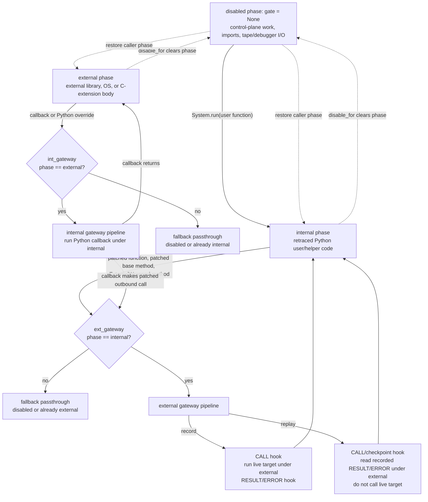

# Proxy Design

This document describes the current proxy boundary implemented by
`system.py`, `gateway.py`, `patchtype.py`, and `io.py`.

On the live CLI/runtime path, the important files are `system.py`, `gateway.py`,
`patchtype.py`, `io.py`, `proxytype.py`, the `Tape` protocols in
`proxy/tape.py`, and top-level `tape.py` recording I/O. Older context/spec
helpers were used to wire the same ideas for tests and transitional code, but
they are not the main mental model for the current runtime.

Use this file as the proxy behavior contract. Before changing proxy-layer code,
read `src/retracesoftware/proxy/AGENTS.md`, then this document, then compare
the current code to the expected behavior described here. For debugging work,
start by answering:

- what phase should the system be in (`disabled`, `internal`, `external`)
- which gateway should be active for the next crossing
- what message, binding, or materialization event should happen next
- where the first observed divergence from that contract occurs

## Purpose

The proxy layer is the record/replay boundary.

- Internal code is deterministic Python code that should run again during replay.
- External code is nondeterministic library, OS, or C-extension behavior that
  must be intercepted.
- Retrace does not snapshot the whole process. It records boundary crossings and
  later replays those crossings while re-executing the Python code around them.

At a high level:

- `System` owns long-lived runtime state.
- `gateway.py` builds the callable pipelines that cross the boundary.
- `patchtype.py` mutates types so those gateways are actually used.
- `io.py` supplies record- or replay-specific hooks, messages, and binding
  behavior.

## Main Pieces

- `System`
  Owns the phase gate, patching helpers, proxy walkers, binding helpers,
  thread-id tracking, and install-time plumbing.
- `gateway.ext_gateway()` / `gateway.int_gateway()`
  Build the record-time outbound and callback pipelines.
- `gateway.ext_replay_gateway()` / `gateway.int_replay_gateway()`
  Build the replay-time versions of those pipelines.
- `patch_type()`
  Mutates patched types in place so base methods route through the external
  gateway and Python overrides route through the internal gateway.
- `stream.Binder`
  Assigns stable handles to live objects and types so later messages can refer
  to them by identity.
- `recorder()` / `replayer()`
  Build protocol hooks and replay sources, then configure a `System` instance
  with the right gateways, lifecycle hooks, and binding behavior.

## Core Runtime Model

## How To Use This Document

When a proxy bug or replay mismatch appears, use this document to check the
expected contract before editing code:

1. Identify the intended boundary crossing:
   internal -> external call, external -> internal callback, disabled
   control-plane work, bind/materialization, or thread replay.
2. Identify which phase and gate should be active at that point.
3. Trace the current CLI runtime path from `src/retracesoftware/__main__.py`
   through `io.py`, `gateway.py`, `patchtype.py`, and `system.py` (with
   `proxytype.py` and `install/`).
4. Find the first mismatch between the observed behavior and this design.
5. Only then choose the narrowest responsible fix.

If you cannot say which design rule is being violated, keep tracing instead of
editing proxy-kernel code.

The current design is centered on a single phase thread-local:

- `None`
  Retrace is disabled on this thread.
- `'internal'`
  We are executing retraced Python code.
- `'external'`
  We are executing an external call body.

`System` stores that phase in:

- `gate = utils.ThreadLocal(None)`

Everything else is built around that value:

- `System.enabled()` checks whether retrace is active.
- `System.location` reports the current phase.
- `disable_for()` temporarily clears the phase so control-plane work does not
  retrace itself.
- `_on_alloc` uses the phase to decide whether a newly allocated object should
  be bound, reported as an async allocation, or ignored.

The two public gateway objects are phase-sensitive callables created from that
same thread-local:

- `System.ext_gateway = gate.if_then_else('internal', fallback, fallback)`
- `System.int_gateway = gate.if_then_else('external', fallback, fallback)`

Their `on_then` branch is installed by `System.run()` using a factory from
`gateway.py`. Outside an active run they fall back to transparent passthrough.
Inside an active run, the top-level user function executes under the
`'internal'` phase so the first patched outbound call enters the external
gateway instead of falling through as disabled passthrough.

### Gate dispatch diagram



The phase predicate decides whether a gateway is active. `ext_gateway` only
handles calls that leave retraced Python while the phase is `'internal'`;
`int_gateway` only handles callbacks that re-enter Python while the phase is
`'external'`. `disable_for()` is different: it clears the phase for
control-plane/runtime work and then restores the caller's previous phase.

## How The Two Gateways Interact

The most important idea in this design is that the two gateways are not two
independent systems. They are the two directions of the same boundary and they
alternate as control moves back and forth between Python and external code.

### External gateway

The external gateway is used for internal-to-external calls:

- patched base methods on patched types
- patched standalone functions
- generated external proxy methods

In record mode, `gateway.ext_gateway()` builds this shape:

1. proxy call arguments with `int_proxy`
2. observe the call with record hooks
3. switch phase to `'external'`
4. unwrap `ExternalWrapped` inputs with `unproxy_ext`
5. call the real target via `utils.try_unwrap_apply`
6. proxy the result back with `ext_proxy`
7. convert wrapped results back into internal view with `unproxy_int`

In replay mode, `gateway.ext_replay_gateway()` keeps the same outer shape, but
step 5 is replaced with a supplied replay runner that reads the next recorded
result instead of executing the live external function.

### Internal gateway

The internal gateway is used for external-to-internal callbacks:

- Python overrides on subclasses of patched base types
- internal helper work intentionally routed through retrace

In record mode, `gateway.int_gateway()` builds this shape:

1. proxy callback inputs with `ext_proxy`
2. observe the callback with callback hooks
3. switch phase to `'internal'`
4. unwrap `InternalWrapped` inputs with `unproxy_int`
5. call the Python target
6. proxy the result back with `int_proxy`
7. convert wrapped results back into external view with `unproxy_ext`

In replay mode, `gateway.int_replay_gateway()` is smaller because replay
callbacks are already decoded from tape into live Python objects before
execution. It still observes the callback and runs it under the `'internal'`
phase, but it does not need the same outer input/output adaptation that record
uses for live external callbacks.

### The ping-pong between them

The gateways are meant to alternate as control crosses the boundary:

1. Internal Python calls a patched base method.
2. That enters the external gateway and switches to `'external'`.
3. External code may call back into a Python override on a patched subtype.
4. That override enters the internal gateway and switches back to `'internal'`.
5. If that callback body makes another outbound external call, control returns
   to the external gateway again.

That back-and-forth is the core semantic model. The current phase tells Retrace
which side is currently executing, while the two gateways determine how values
and hooks are adapted as control crosses the boundary in each direction.

### Hook wiring names

The runtime names `primary_hooks` and `secondary_hooks` are historical and easy
to misread. They are not "external hooks" and "internal hooks". `System.run()`
cross-wires them into the two gateways so each boundary direction emits the
right envelope:

| Gateway | `on_call` source | result/error source | Record messages |
| --- | --- | --- | --- |
| external gateway (`internal` -> `external`) | `secondary_hooks.on_call` | `primary_hooks.on_result` / `primary_hooks.on_error` | `CALL`, then `RESULT` / `ERROR` |
| internal gateway (`external` -> `internal`) | `primary_hooks.on_call` | `secondary_hooks.on_result` / `secondary_hooks.on_error` | `CALLBACK`, then `CALLBACK_RESULT` / `CALLBACK_ERROR` |

Replay uses the same wiring but swaps the hook bodies for message consumption,
checkpoint comparison, and materialization bookkeeping. When debugging hook
changes, reason from the gateway direction first; do not infer the message type
from the word "primary" or "secondary".

## Record Versus Replay

Record and replay share the same patched code paths. The difference is in what
the gateways do once a call reaches them.

### Record

Record mode executes the real external code and writes a description of what
happened.

`io.recorder()` configures:

- binder-backed `on_bind` behavior that emits `NEW_BINDING`
- lifecycle hooks like `ON_START`
- outer-call hooks for `CALL`, `RESULT`, `ERROR`, `CHECKPOINT`, and optional
  `STACKTRACE`
- callback hooks for `CALLBACK`, `CALLBACK_RESULT`, and `CALLBACK_ERROR`

The important split is:

- the external gateway records the outer call
- the internal gateway records nested callbacks made by that external call

So a recorded external operation may write a sequence like:

1. `CALL`
2. zero or more nested `CALLBACK` / `CALLBACK_RESULT` pairs
3. `RESULT` or `ERROR`

Record mode is therefore the mode that executes live nondeterministic behavior
and turns it into an ordered message stream.

### Replay

Replay mode does not execute live external behavior on the normal path. Instead
it consumes the message stream that record produced.

`io.replayer()` builds a layered replay source:

1. `_RawTapeSource`
2. `_ThreadDemuxSource`
3. `_ReplayBindingState`
4. `_IoMessageSource`

That stack gives replay three things at once:

- per-thread message ordering
- handle resolution for bound objects
- decoded message objects like `ResultMessage` and `CallbackMessage`

For an outbound external call, replay:

1. enters the external gateway through the same patched method/function path
2. emits replay-side call/checkpoint hooks
3. reads replay messages until it reaches the matching `RESULT` or `ERROR`
4. runs any interleaved `CallbackMessage` instances immediately in live Python
5. returns the recorded result instead of calling the real external target

For callbacks, replay still executes the Python callback body live. What changes
is the external side: replay is driving the boundary from recorded messages
instead of live nondeterministic behavior.

## Debug Checkpoints And Equality

Debug checkpoints and stacktraces are replay-significant guard rails. They are
allowed to add messages, but they must not change application scheduling or
which thread consumes the next protocol item.

Checkpoint comparison is semantic comparison, not raw `==`.

Replay-side `equal()` intentionally normalizes several values that can differ in
live identity while still representing the same boundary event:

- wrapped callables are compared through their underlying target
- `ExternalWrapped` values compare by boundary role/type rather than live object
  identity
- checkpoint payloads can use external proxy markers for generated proxy types
  and `ProxyRef` handles
- unbound `_thread.lock` and `_thread.RLock` values use explicit type markers
  because those objects may need live replay counterparts
- call payload comparison normalizes descriptor receivers and known defaulted
  call shapes such as `_socket.socketpair()`

These normalizations are for detecting real divergence without reporting false
positives from replay-local object identities. They are not a license to ignore
message ordering: a checkpoint still belongs to one logical thread and one exact
place in that thread's message stream.

## Object Categories At The Boundary

Not every value crossing the boundary is treated the same way. A useful mental
model is that Retrace classifies values into a few operational categories.

### 1. Immutable passthrough values

These are values whose type is in `System.immutable_types`.

Examples are things like:

- `int`
- `str`
- `bytes`
- `bool`
- other explicitly configured immutable leaf types

These values cross the boundary by value. They are not wrapped and do not need
binding just to preserve ordinary behavior.

Operationally:

- outbound calls treat them as safe external-call arguments/results
- callbacks treat them as safe internal-call arguments/results
- replay can compare or reconstruct them directly without needing object
  identity

This is the cheapest category and is the baseline "normal Python value"
behavior.

### 2. Internal-proxied values

These are live internal Python objects that cannot safely be handed directly to
external code, so they are wrapped in an `InternalWrapped` dynamic proxy.

This happens on the callback-return / internal-to-external adaptation path,
primarily through `System.int_proxy`.

An internal proxy means:

- external code receives a stable wrapper object instead of the original Python
  object
- later calls on that wrapper can re-enter retraced Python through the internal
  gateway
- the wrapper itself may be bound if later messages need to refer to it by
  identity

So "internal proxied" means "this value still logically belongs to the internal
world, but it is being exposed to the external world through a controlled
wrapper."

### 3. External-proxied values

These are live external objects that cannot safely cross into retraced Python as
raw values, so they are wrapped in an `ExternalWrapped` dynamic proxy.

This happens on the external-result / external-to-internal adaptation path,
primarily through `System.ext_proxy`.

An external proxy means:

- internal code receives a wrapper rather than the raw external object
- later method calls on that wrapper route back out through the external gateway
- replay can preserve object identity by binding the logical external object
  instead of trying to serialize the raw live object

So "external proxied" means "this value logically belongs to the external
world, but retraced Python is holding a controlled handle to it."

### 4. Patched objects and patched types

Patched objects are instances whose type family has been patched by
`patch_type()`. Patched types themselves are also first-class boundary objects.

This category is special because patched objects are not just "values that may
need wrapping". They already participate in the boundary protocol by virtue of
their type.

That changes the rules:

- methods on patched base types already route through the external gateway
- Python overrides on subclasses of a patched family already route through the
  internal gateway
- allocation of patched objects is intercepted by `_on_alloc`
- patched types and many patched instances are bound because replay may later
  need to refer to them by identity

Patching is type-family oriented. Patching a base type also patches existing
subclasses that can be callback targets. If a later module config explicitly
names one of those subclasses, that same-system patch is a no-op: it must not
wrap methods twice, emit duplicate bindings, or change binding order. This
comes up in C extension families that expose both a base class and concrete
subclasses from the same module.

Patch state is stamped on the class. A type already patched by the same
`System` is idempotent; a type patched by a different `System` is an error.
This prevents nested test/runtime systems from silently sharing one mutated type
family.

Some attributes are deliberately never patched:

- `__new__`
- `__getattribute__`
- `__del__`
- `__dict__`

Those slots are too fundamental or too timing-sensitive to route through the
ordinary method wrapper path. `types.MemberDescriptorType` and
`types.GetSetDescriptorType` are not treated as ordinary callables either; they
are exposed through descriptor proxy types so descriptor access still has the
right boundary shape.

For extendable bases, the base type is bound before existing subclasses are
retro-patched. That preserves the same binding order as "patch base, then define
subclass later". If patching fails partway through, rollback must restore
wrapped attributes, allocation hooks, bind support, and retrace stamps; a
half-patched type family is not a valid state.

Pre-existing instances of patched types are not automatically "new" just
because their type was patched later. If such an instance is an exported module
singleton, descriptor field, or other stable library object that application
code will use through patched methods, the responsible module config should
bind that object explicitly. Late discovery during replay is too late: replay
will expect the matching bind marker at the same logical point record emitted
it.

In practice, patched values sit between ordinary passthrough values and
ordinary proxied values:

- they are not inert leaf data
- they often should not be wrapped again as though they were unknown objects
- their allocation/binding behavior matters to replay even before a normal
  method result is observed

### Why the distinction matters

These categories drive the proxy walkers in `System.ext_proxy` and
`System.int_proxy`.

The questions Retrace is really asking for each value are:

1. can this cross by value?
2. is this already a wrapped/bound boundary object?
3. is this part of a patched type family and therefore already boundary-aware?
4. if not, do we need an internal proxy or an external proxy?

That is why the same logical object may be treated differently depending on the
direction of travel:

- an external object returned into Python tends to become an `ExternalWrapped`
  proxy
- an internal object exposed outward tends to become an `InternalWrapped` proxy
- a patched object may instead trigger allocation/binding flow
- an immutable value may pass straight through untouched

If this classification is wrong, replay usually fails in one of two ways:

- identity drift: later calls resolve to a different logical object
- boundary drift: the right object exists, but it is being observed from the
  wrong side of the boundary

## Binding

Binding is how Retrace preserves identity without serializing arbitrary live
objects.

### What gets bound

The system binds more than just "user-facing external objects". It binds
whatever later tape messages need to refer to by identity, including:

- patched types
- wrapped helper callables
- generated proxy types
- live external objects
- replay-side materialized objects

`System.bind` is a local identity registration hook. In recorder mode it is
composed with a `stream.Binder` plus protocol writers. In replay mode it is
composed with replay-side handle registration.

There are two related but different operations:

- `system.bind(obj)`
  Marks the object as locally bound and runs the active bind hook. During record
  this usually emits a `NEW_BINDING`; during replay it usually consumes the next
  bind marker and maps its handle to `obj`.
- `system.is_bound.add(obj)`
  Marks the object as locally trusted without running `on_bind`. This is only
  for Retrace's own runtime/control-plane objects such as tape writers, stream
  chains, recorder locks, and protocol helpers that must not appear in the
  application trace.

Confusing these operations changes the protocol stream. Calling `bind()` for
control-plane plumbing emits or consumes a binding that application replay does
not expect; using only `is_bound.add()` for an application-visible object loses
the handle replay needs later.

### How record uses binding

Record uses `stream.Binder` to assign stable handles to live objects and types.

Those handles are written anywhere later messages need object identity instead
of by-value serialization, for example:

- callback targets and callback arguments
- result objects
- patched type families
- generated proxy classes

The binder is therefore part of correctness, not just metadata. If record binds
the wrong logical object or binds it at the wrong time, replay will resolve a
different live object later and the message stream will diverge.

### How replay uses binding

Replay uses `_ReplayBindingState` to map recorded handles back to live objects.

That layer is responsible for:

- resolving recorded `stream.Binding` values to live Python objects
- accepting replay-time `bind()` calls when new live objects are created
- associating recorded handles with replay-created live objects
- dropping mappings when close/delete messages arrive

Any replay path that consumes a bind marker for a live object must also mark
that object as locally bound in `System.is_bound`. Otherwise the next use of
the same live object can try to bind it again and consume the following
unrelated message.

That means binding is the bridge between recorded identity and live replay
identity.

## Allocation And Materialization

Patched object allocation is handled by `System._on_alloc`, which dispatches on
the current phase:

- `'internal'` -> bind the newly created object directly
- `'external'` -> call `async_new_patched`
- `None` -> do nothing

During replay, the internal allocation path still has to align with the
recorded protocol stream before consuming the bind marker. A patched object may
be allocated while callback/call envelope messages from earlier Retrace helper
work are still next in that thread's stream. Replay must drain those envelope
messages, run callback bodies when they are real internal callbacks, and then
bind the live object to the recorded handle. Normal `ExpectedBindMarker`
lookahead must not escape from an allocation hook: some native/Cython extension
types do not safely unwind Python exceptions raised from their allocation path.

This internal allocation path is only for allocation identity. It is not a safe
place to live-run native extension behavior during replay. If a native type does
external work in its constructor/`__new__`, replay should use an inert replay
substitute rather than invoking the native constructor.

### Replay-only native type stubs

Some external native types are opaque handles from the application's point of
view. `grpc._cython.cygrpc.Server` is the model case: Retrace never needs a real
grpc C-core server for its own control plane, and application-visible behavior is
method traffic that belongs on the recorded boundary.

For those types, the preferred design is a replay-only module-config directive:

```toml
proxy = ["Server"]
stub_for_replay = ["Server"]
```

`stub_for_replay` means: during replay, before normal proxy/type machinery
inspects the module binding, replace the configured native type with a generated
Python stub type. The stub preserves shape, not behavior:

- it remains a type, so subclass declarations and ordinary type-shape
  introspection stay locally coherent on replay
- it preserves the original `__module__`, `__name__`, `__qualname__`, and public
  method/property names needed by proxy generation
- `__new__` creates only a minimal inert object that can be bound to the recorded
  handle
- non-constructor methods and properties exist only so proxy generation can see
  them; if one is called directly, that is a proxy-routing logic error and must
  raise a clear replay-stub exception

The normal proxy machinery then runs against the stub type. Application-visible
method calls should cross the boundary and consume recorded messages; they
should not execute stub method bodies, and they must not enter the native
extension.

This is different from replacing a class with a plain constructor function. A
function facade can avoid native construction, but it breaks class syntax and
type checks such as `class Sub(module.Type): ...` or
`isinstance(value, module.Type)`. A replay stub type preserves more of the Python
object-model shape while still keeping replay out of native code.

Use `stub_for_replay` only when all of the following are true:

- the type is an opaque external handle, not deterministic local Python state
- Retrace's own replay/control-plane machinery does not need real instances of
  the type
- all meaningful application-visible operations on instances are retraced
  boundary traffic
- exact native C struct identity is not required by live replay code

Do not use `stub_for_replay` for public runtime types such as `_socket.socket`
where real type identity, subclassing across libraries, descriptors, alternate
native creation paths, or Retrace control-plane use require in-place patching or
real disabled-context objects.

### Live factory, proxied result

Some callables create local runtime primitives that must exist in both record
and replay, while the object they return still needs Retrace identity and
method-boundary handling. For these, use:

```toml
ext_proxy_result = ["make_handle"]
```

`ext_proxy_result` means:

- record and replay both call the real function in the caller's current
  Retrace phase
- the function call itself is not recorded as an external `CALL`/`RESULT`
- the returned object is passed through the same proxy/binding machinery used
  for external results
- later operations on the returned object use the normal boundary rules for
  that object
- the factory must not call back into retraced Python on the current thread,
  and its inputs must already be ordinary unwrapped values
- the factory must not allocate through patched Python constructors or otherwise
  trigger Retrace hooks before the returned value reaches `ext_proxy`

This is intentionally narrower than `proxy`. Ordinary `proxy` means the call is
external behavior: record runs it and replay consumes the recorded result.
`ext_proxy_result` means the call is local runtime construction, but the
returned object is exposed to retraced Python through `System.ext_proxy`. Lock
factories are the model case, but module configs should not use this directive
for network, filesystem, database, or native service handles unless replay
truly needs a live local object.

The `'external'` case exists for the narrow materialized-replay path. This path
is not a general way to recreate external objects during replay. It exists for
cases where retrace is disabled but replay still needs a real live object for
CPython/runtime mechanics to work, with module-level locks as the model case.

In recorder mode, `async_new_patched` synthesizes retraced helper work around
allocation so replay has a recorded marker for the disabled-context object it
must recreate.

In replay mode, materialization code may create the minimum real object needed
while retrace is disabled, associate it with the recorded binding handle, and
then check that replay stayed aligned with the recorded result or error.

The point is not identity-preserving reconstruction for ordinary external-call
results. Normal replay consumes recorded outcomes and must not call the live
external implementation. Materialized replay is only for the small disabled-gate
case where a real object is required locally even though the application-visible
result still comes from the recording.

The materialized object must be:

- created under `disable_for()`
- limited to current, concrete disabled-runtime needs
- bound to the recorded handle at the matching point in the stream
- invisible as general replay-side external execution

Do not expand materialized replay to file descriptors, sockets, SSL objects,
random generators, or other external resources merely because they have live
state. If normal replay can return the recorded value or a proxy/stub without a
real disabled-context object, materialized replay is the wrong tool.

## Internal Retrace: Using The Boundary On Ourselves

Retrace does not only proxy user code. Some internal helper work also needs to
go through retrace so record and replay see the same helper-created objects.

There are two main patterns.

### 1. Wrapped internal helpers

`System.wrap_async()` wraps an internal helper through the internal gateway.

This is used in `io.py` for helpers like:

- `utils.create_stub_object`
- `gc.collect`

The point is not "make these helpers external". The point is: when these helpers
participate in the observable boundary protocol, run them through the same
callback-style machinery so their effects are recorded and replayed in order.

### 2. Proxy generation through retrace

`System.__init__()` also wraps `_ext_proxytype_from_spec` through the internal
gateway:

- `self.ext_proxytype_from_spec = self._wrapped_function(self.int_gateway, _ext_proxytype_from_spec)`

That is how Retrace captures external proxy generation itself.

When Retrace needs to generate an external proxy type:

1. `_ext_proxytype_from_spec` runs through the internal gateway
2. the generated proxy type is patched into the target module slot
3. the proxy type is bound
4. its `ProxyRef` factory is also bound

This matters because later messages may refer to that generated proxy type by
identity. If proxy generation happened as an invisible local side effect, replay
would have to guess when and how to recreate the type. By retracing the helper,
record and replay stay aligned on proxy-type creation as part of the ordinary
boundary protocol.

This is the main example of "using Retrace internally to retrace Retrace's own
helper work" in a controlled way.

## `disable_for()`

`disable_for()` is the opposite mechanism. It temporarily clears the phase gate
so internal control-plane work does not retrace itself.

Typical uses include:

- stacktrace bookkeeping
- unexpected-message handling
- desync reporting
- thread bootstrap waits for disabled/internal helper threads
- other protocol plumbing that must stay invisible to replay

The safe mental model is:

- if a helper creates observable boundary artifacts that replay must reproduce,
  route it through the internal gateway
- if a helper is only control-plane bookkeeping, run it under `disable_for()`

Disabled callables are marked, not just wrapped. Thread startup checks that
marker before installing normal application-thread retrace state, so Retrace's
own disabled helper work stays outside the boundary even when it is used as a
thread target.

## Threads

The boundary is thread-aware. A thread is part of the retraced application
whenever it can run user/library Python while retrace is active, or whenever it
can call patched external functions on behalf of that Python.

### Thread propagation

- `System` assigns stable logical thread ids. These are not OS thread ids.
- `wrap_start_new_thread()` propagates retrace state into child threads.
- Child threads that run application/library code must start in the internal
  phase with the assigned logical thread id.
- The logical thread id is assigned before the child runs user/library code;
  otherwise the first child-thread boundary message can be recorded against the
  wrong thread route.
- A child application thread must not begin as disabled passthrough, or its
  first outbound external call can escape recording and replay will diverge.
- CPython/bootstrap synchronization around thread creation is not application
  work. Changes here must not perturb `threading.Thread.start()`,
  `_started.wait()`, or similar runtime plumbing.

Control-plane threads are different: debugger/replay infrastructure I/O may
need to bypass retrace entirely. Do not fix an application-thread miss by making
all threads retraced indiscriminately.

### Thread message ordering

Record writes one unified stream. To make that stream replayable:

- recorder mode writes `THREAD_SWITCH` before messages from a different logical
  thread
- replay mode uses `_ThreadDemuxSource` to route the unified stream back to the
  logical thread that is currently asking for data
- `_ReplayBindingState` must buffer lookahead per logical thread, not globally

The invariant is not merely "the same messages eventually occur". It is "each
logical thread observes the same message sequence in the same order". One
thread must never consume another thread's `RESULT`, `ERROR`, binding event, or
debug checkpoint.

### Cross-thread synchronization

Thread synchronization is part of the boundary contract, especially in debug
checkpoint mode. Common shapes include:

- a main thread schedules work into an event-loop or portal thread and waits on
  a `Future`
- a child thread notifies a `Condition`, writes an event-loop wakeup byte, or
  releases a lock that the main thread is waiting on
- a replay thread blocks until another logical thread reaches the corresponding
  recorded message

Blocking synchronization calls are observable external behavior, but tracing
them must remain observational. Proxy/debug/checkpoint machinery must not:

- hold recorder protocol locks while a thread can block waiting for another
  retraced thread
- change lock/RLock identity, ownership, recursion depth, or notification state
- consume or hide event-loop wakeup bytes
- delay a `notify`, wakeup write, or future completion behind unrelated
  protocol bookkeeping
- introduce checkpoint traffic that causes one logical thread to consume the
  other thread's next message

The required regression shape is: one thread schedules work into another
application thread, then blocks on a `Future`/`Condition` while the child thread
must continue running retraced code. This must make progress in both record and
replay, with and without `--stacktraces`.

Known examples of this gap are an anyio blocking portal
(`tests/install/external/test_anyio_from_thread_replay_dispatcher_regression.py`)
and the stdlib `asyncio.run_coroutine_threadsafe` scenario in
`tests/test_record_replay.py`.

## Hash Determinism

`System.install()` also installs deterministic hash patching. The proxy layer
cannot allow default memory-address-based object hashes to leak into
replay-sensitive ordering, because set iteration and other hash-dependent
behavior can otherwise differ between record and replay.

Hash patching is phase-aware through the same gate dispatch model as the rest of
the proxy kernel. Changes to `System.install()`, phase dispatch, or the
disabled/internal/external split must preserve that hash determinism contract.

## Important Invariants

- The two gateways are complementary halves of one boundary, not separate
  systems.
- Record executes live external code; replay consumes recorded outcomes.
- Callback execution is part of the external call contract.
- Bind open/close behavior is part of correctness, not bookkeeping noise.
- Generated proxy types and helper-created stub objects must be captured when
  later replay depends on their identity.
- Control-plane work must stay outside retrace unless it is intentionally being
  modeled as retraced helper work.
- Debug/checkpoint/stacktrace mode may add trace messages, but it must not
  change thread scheduling, lock wakeups, condition notifications, or event-loop
  progress.
- Local-only runtime binding uses `System.is_bound.add()` and must not emit or
  consume protocol binding markers.
- Replay live execution is limited to explicit local-runtime factories
  (`ext_proxy_result`) or the disabled-context materialized replay exception, and
  must still consume and compare the recorded stream where one exists.
- If replay consumes a different message sequence than record produced,
  everything after that point is suspect.

## Module Config Interface

The proxy kernel is normally reached through install-layer module config. Many
boundary bugs are best fixed there instead of in `system.py`, `gateway.py`, or
`io.py`.

The main TOML directives map to proxy behavior like this:

- `proxy`
  Patch named types or callables so they route through the external gateway.
- `ext_proxy_result`
  Replace named callables with wrappers that live-run the callable in both
  record and replay, then route only the returned object through `ext_proxy`.
  Use this for local runtime factories, not ordinary external calls.
- `patch_types`
  Patch named types in place without replacing the module attribute.
- `immutable`
  Add named types to `System.immutable_types` so values cross by value.
- `bind`
  Pre-register stable module objects or enum members that later messages need
  by identity.
- `disable`
  Replace named callables with `system.disable_for(...)` wrappers.
- `wrap`
  Apply an explicit wrapper factory before/around proxy behavior.
- `replay_materialize`
  Register callables for the narrow disabled-retrace case where replay needs a
  real local object, such as a module lock. Do not use this for ordinary
  external resources.
- `stub_for_replay`
  Replay-only native-type substitution for opaque external handle types. The
  generated stub type preserves shape for proxy generation and type syntax, but
  direct execution of stub members is a logic error. This avoids native
  constructor/method execution on replay without creating real materialized
  resources.
- `pathparam`
  Route filesystem-like calls through proxying only when the configured path
  predicate says the path belongs in the recording.
- `patch_hash`
  Participates in deterministic hash behavior installed by `System.install()`.

If new nondeterministic library behavior can be described by one of these
directives, prefer that narrow module-config fix over changing gateway or kernel
semantics.

## Reading The Code

If you are debugging this layer, start here:

- `gateway.py`
  The concrete inbound/outbound pipelines.
- `System.run()`
  Where gateway factories are installed for a live run.
- `patchtype.py`
  How types and subclass overrides are rewritten to enter the gateways.
- `io.recorder()`
  How record-mode hooks, binder writes, and async allocation behavior are wired.
- `io.replayer()`
  How replay consumes messages, runs callbacks, materializes objects, and binds
  live replay objects to recorded handles.

## Suggested Test Matrix

These scenarios are a good minimal coverage set for the live proxy runtime path.
They are written as behavior-oriented cases rather than as specific test file
names so they can be used for unit tests, integration tests, or replay
regressions.

| Scenario | Example shape | Main paths exercised | What to assert | Relevant tests |
| --- | --- | --- | --- | --- |
| Simple proxied function call | `time.time()` | External gateway, record `CALL`/`RESULT`, replay result consumption | Record runs the live call once; replay returns the recorded value without touching the live clock | [`test_system_io_round_trips_simple_patched_function_with_tape`](../../../tests/proxy/test_system_io_tape.py), [`test_install_and_run_round_trips_time_proxy_with_memory_tape`](../../../tests/test_main_memory_tape.py) |
| Simple proxied function error | `os.chdir("/definitely/missing")` | External gateway, error serialization, replay `ERROR` path | Record writes the failure; replay raises the same semantic error without making the live syscall | [`test_system_io_round_trips_simple_patched_function_error_with_memory_tape`](../../../tests/proxy/test_system_io_tape.py), [`test_install_and_run_round_trips_os_chdir_error_with_memory_tape`](../../../tests/test_main_memory_tape.py) |
| Patched type method call | `lock.acquire(False)` or `socket.recv()` on a patched object | Patched method rewrite, external gateway, wrapped receiver/args | Patched methods route through the boundary and preserve the expected wrapped receiver behavior | [`test_install_and_run_round_trips_allocate_lock_with_memory_tape`](../../../tests/test_main_memory_tape.py) |
| Patched type method returning another external object | `socket.makefile()` or similar | External result proxying, binding, replay-side hydration | Record writes proxy metadata/bindings; replay reconstructs a usable external proxy rather than leaking raw metadata | [`test_system_io_round_trips_external_result_proxy_hydration_with_memory_tape`](../../../tests/proxy/test_system_io_tape.py) |
| External code calling back into Python | `sorted(items, key=callback)` or `executor.submit(fn)` style callback | Internal gateway, callback hooks, callback result/error recording | The Python callback body executes live on both record and replay, and callback events stay aligned | [`test_system_io_round_trips_simple_override_callback_with_tape`](../../../tests/proxy/test_system_io_tape.py), [`test_system_io_records_and_rebinds_callback_receiver_with_tape`](../../../tests/proxy/test_system_io_tape.py) |
| Standalone callback envelope before next call or bind | Protocol callback work is emitted before the next external `CALL` or patched-object bind | Replay callback consumption, message lookahead | Replay executes callback envelopes before matching the next outbound call; for async patched-object binding, replay skips the stub-helper envelope and binds the live object to the recorded marker | [`test_replayer_skips_standalone_callback_result_before_next_call`](../../../tests/proxy/test_system_io_tape.py), [`test_replayer_skips_stub_callback_before_async_new_patched_bind`](../../../tests/proxy/test_system_io_tape.py) |
| Internal patched-object allocation after callback envelope | A patched object is allocated after helper/callback traffic | `System._on_alloc`, replay bind alignment, allocation-hook exception safety | Replay drains allowed envelope messages, binds the live object to the recorded handle, and does not let `ExpectedBindMarker` escape through native allocation | [`test_replayer_runs_callback_before_internal_patched_alloc_bind`](../../../tests/proxy/test_system_io_tape.py) |
| Native constructor that performs external work | `grpc.server(...)` calls Cython `cygrpc.CompletionQueue(...)` / `cygrpc.Server(...)` | `stub_for_replay`, async patched-object binding | Record may run the native constructor, but replay uses a recorded/stubbed object and does not live-run native constructor code | [`test_replay_grpc_server_construction_does_not_segfault`](../../../tests/install/external/test_grpc_server_replay_regression.py) |
| Live local factory with ext-proxied result | A lock-like factory returns a runtime object | `ext_proxy_result`, phase-preserving live factory call, returned-object ext-proxying | Record and replay both call the real factory without changing the current phase, the factory call is not a `CALL`/`RESULT`, and the returned proxy shell is not itself bound | [`test_ext_proxy_result_live_runs_factory_and_wraps_returned_object`](../../../tests/proxy/test_system_io_tape.py) |
| Callback makes another outbound external call | Callback body calls `time.time()` | Internal gateway re-entry back into external gateway | Nested callback-originated external calls preserve ordering and do not bypass retrace | [`test_system_io_round_trips_nested_callback_external_call_with_memory_tape`](../../../tests/proxy/test_system_io_tape.py) |
| Immutable passthrough value crossing the boundary | `time.sleep(0)` / small ints / strings / bytes | Passthrough predicates, no unnecessary proxying | Immutable values stay unproxied and behavior matches normal Python on both record and replay | [`test_system_io_round_trips_simple_patched_function_with_tape`](../../../tests/proxy/test_system_io_tape.py) |
| Internal Python object exposed to external code | Python file-like / callback / user object passed into patched library code | `int_proxy`, `InternalWrapped`, external-to-internal callback path | External code sees a stable wrapper and later calls route back into Python through the internal gateway | [`test_system_io_replays_dynamic_internal_proxy_callback_side_effect_with_memory_tape`](../../../tests/proxy/test_system_io_tape.py) |
| External object passed back into internal code | Return a socket/lock/file object, store it, call methods later | `ext_proxy`, `ExternalWrapped`, binding identity preservation | Multiple later uses refer to the same logical recorded object and replay preserves handle identity | [`test_system_io_round_trips_external_result_proxy_hydration_with_memory_tape`](../../../tests/proxy/test_system_io_tape.py), [`test_system_io_records_and_rebinds_callback_receiver_with_tape`](../../../tests/proxy/test_system_io_tape.py) |
| Overlapping type-family config | Config names both a patched base type and one of its subclasses | `patch_type()`, subclass patching, binding order | Same-system patching is idempotent and does not wrap or bind the subclass twice | [`test_patch_type_is_idempotent_for_subtypes_patched_through_base`](../../../tests/proxy/test_replay_materialize.py) |
| Pre-existing patched singleton | `random._inst` used through module-level `random.uniform()` | Module config `bind`, patched instance identity | Existing singleton objects of patched types are bound explicitly so replay sees the same logical object | [`test_replay_anyio_task_group_with_random_delays_does_not_diverge`](../../../tests/install/external/test_anyio_task_group_random_replay_regression.py), [`test_random_choice_replay_equals_record`](../../../tests/install/stdlib/test_random.py) |
| Generated external proxy type creation | First encounter of a new external type/spec | `_ext_proxytype_from_spec`, internal retrace of helper work, binding of type + `ProxyRef` | Proxy-type generation is itself captured so replay recreates the same proxy class identity at the right point | [`test_system_io_records_callback_for_new_ext_proxy_type_with_memory_tape`](../../../tests/proxy/test_system_io_tape.py) |
| Replay hydration of `ProxyRef` results | Replay returns a bound proxy-producing handle | `_ReplayBindingState`, binding resolution, `ProxyRef` hydration | Replay deserialization turns the recorded `ProxyRef` into a live proxy shell before user code observes it | [`test_replay_binding_state_hydrates_proxy_ref_bindings`](../../../tests/proxy/test_system_io_tape.py), [`test_system_io_round_trips_external_result_proxy_hydration_with_memory_tape`](../../../tests/proxy/test_system_io_tape.py) |
| Materialized replay escape hatch | Call a configured lock materialization target while retrace is disabled on replay | `replay_materialize`, `disable_for()`, unbound lock/RLock handling | The unusual disabled replay call materializes the expected object without consuming the next unrelated recorded result | [`test_replay_materialize_disabled_call_does_not_consume_next_recorded_result`](../../../tests/proxy/test_replay_materialize.py) |
| Control-plane work excluded from retrace | Desync reporting, monitoring, stacktrace bookkeeping | `disable_for()`, gate-cleared execution | Helper plumbing does not generate extra boundary traffic or perturb replay alignment | [`test_replay_materialize_disabled_call_does_not_consume_next_recorded_result`](../../../tests/proxy/test_replay_materialize.py) |
| Threaded external activity | Child thread performs proxied calls | `wrap_start_new_thread()`, logical thread ids, `THREAD_SWITCH`, replay demux | Record and replay preserve per-thread message order and deliver results to the right logical thread | [`test_replayer_consumes_protocol_result_after_thread_switch`](../../../tests/proxy/test_system_io_tape.py), [`test_install_and_run_replays_flask_request_from_unretraced_client_thread_with_memory_tape`](../../../tests/test_main_memory_tape.py) |
| Cross-thread synchronization under debug checkpoints | Main thread schedules work into an event-loop/portal thread and waits on a `Future`/`Condition` while `--stacktraces` is enabled | Debug `CHECKPOINT` payloads, patched lock/RLock methods, thread propagation, `THREAD_SWITCH` ordering | Debug/checkpoint tracing must not change lock wakeups, condition notifications, or event-loop thread progress during record or replay | [`test_replay_anyio_blocking_portal_does_not_diverge`](../../../tests/install/external/test_anyio_from_thread_replay_dispatcher_regression.py), [`test_record_then_replay_asyncio_run_coroutine_threadsafe`](../../../tests/test_record_replay.py) |
| Binding cleanup | External object lifetime ends after recorded use | Bind open/close flow, replay binding deletion | Replay drops dead bindings at the right time and does not leak stale handle lookups into later operations | [`test_replay_binding_state_consumes_trailing_binding_deletes`](../../../tests/proxy/test_system_io_tape.py), [`test_raw_tape_source_consumes_binding_delete_before_thread_demux`](../../../tests/proxy/test_system_io_tape.py) |

Taken together, this matrix covers the main boundary directions:
internal -> external calls, external -> internal callbacks, record-only live
execution, replay-only message consumption, binding/materialization, helper
work that must itself be retraced, and bookkeeping that must stay outside the
trace.
